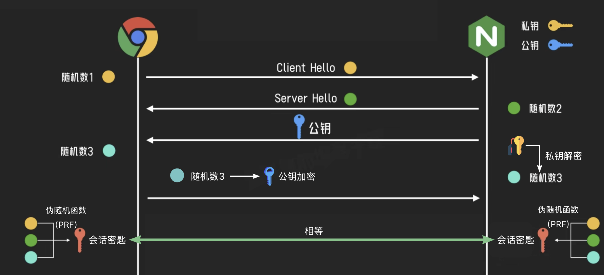
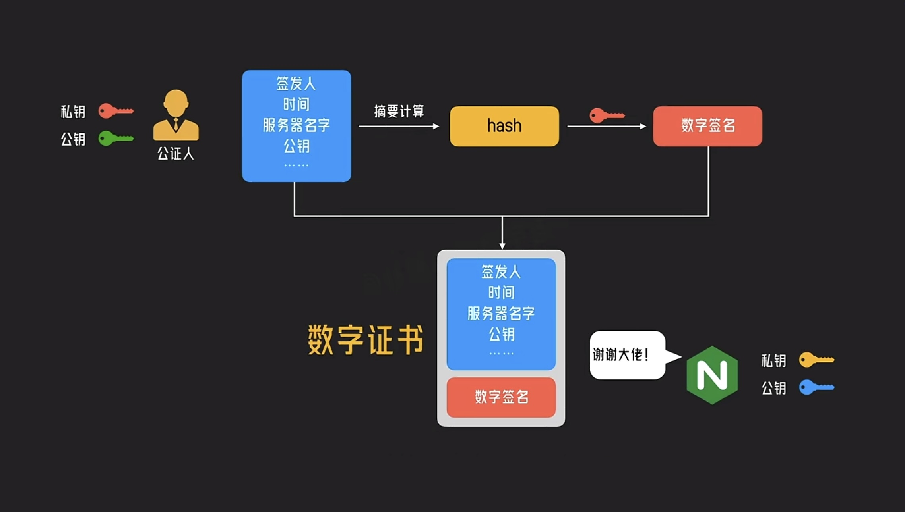
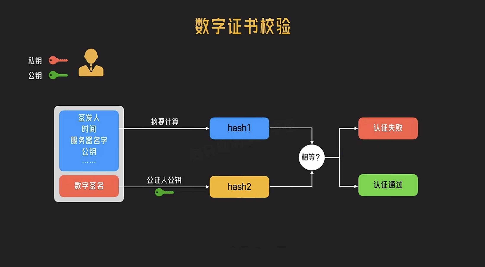

# HTML CSS 笔记

[TOC]

## flex 布局

- 优点：操作方便，布局极为简单，移动端应用广泛
- 原理：通过给**父盒子**添加 display ：flex 属性来控制**子盒子**的位置和排列方式
- flex 父盒子属性

  - flex-direction: row | row-reverse | column | column-reverse;
    设置主轴的方向，元素跟着主轴走

  - justify-content：flex-start | flex-end | center | space-between | space-around;
    设置主轴上子元素的排列方式

  

  - align-content: stretch | flex-start | flex-end | center | space-between | space-around;
    设置侧轴上的元素对齐方式(多行)，若为单行则该属性不起作用

  - align-items: flex-start | flex-end | center | baseline | stretch;
    设置侧轴上的元素对齐方式(单行)，若为多行则元素间的纵向距离不变

  - flex-wrap: nowrap | wrap | wrap-reverse;
    设置子元素是否换行

  - flex-flow 属性是 flex-direction 属性和 flex-wrap 属性的简写形式，默认值为 row nowrap。

- flex 子盒子属性

  - flex：\<number>,flex 属性定义子项分配剩余空间(剩余空间是 flex 容器的大小减去所有 flex 项的大小加起来的大小)，用 flex 来表示占多少份，项目 flex 属性若不为 0，则项目宽度无效
    _实际上：flex 属性是 flex-grow, flex-shrink 和 flex-basis 的简写，默认值为 0 1 auto。后两个属性可选_

    详细说明这三个属性：

    ```css
    flex-grow: 这个属性规定了该子项在 flex 容器中分配剩余空间的相对比例;
    //📌 若flex容器无剩余空间，则该项不生效。

    flex-shrink:指定了 flex 元素的收缩规则。值越大，越收缩
    //📌 flex 元素仅在默认宽度之和大于容器的时候才会发生收缩

    flex-basis: 指定了 flex 元素在主轴方向上的初始大小;
    //📌 当一个元素同时被设置了 flex-basis (除值为 auto 外) 和 width
    (或者在 flex-direction: column 情况下设置了 height), flex-basis
    具有更高的优先级

    ```

- align-self(了解)：属性允许单个项目有其他项目不一样的对齐方式，可覆盖 align-items 属性。默认值为 auto，表示继承父元素的 align-items 属性，如果没有父元素，则等同于 stretch

- order(了解): 定义项目的排列前后顺序(值越小越靠前)

## 阻止事件冒泡/默认事件的方法

> > 注意：
> > 像**onclick 这样的元素**为 non-capture 事件侦听器，他们总**是在冒泡阶段倾听，从不在捕捉阶段触发**
> > 相比之下，**addEventListener**添加了一个事件侦听器，**可以是捕获触发，也可以冒泡触发**

- 1、event.stopPropagation：这是**阻止事件的冒泡**方法，但是默认事件任然会执行，当你调用这个方法的时候，如果点击一个链接\<a>，这个链接仍然会被打开
  (_该语句无论在回调函数中的哪个位置都能产生效果，且不影响回调函数其他代码正常执行_)

  ```js {.font}
  box3.addEventListener("click", () => {
    console.log("第三层被点击");
    event.stopPropagation();
  });

  box3.addEventListener(
    "click",
    () => {
      console.log("第三层被点击");
    },
    true
  ); //第三个参数默认为false，触发=>冒泡
  //当设置为true时，捕获=>触发
  ```

- 2、event.preventDefault()：这是**阻止默认事件**的方法，调用此方法时，\<a>标签链接不会被打开，**但是会发生冒泡**
  (_该语句无论在回调函数中的哪个位置都能产生效果，且不影响回调函数其他代码正常执行_)

  ```js {.font}
  a.addEventListener("click", () => {
    console.log("a tag 被点击"); //会打印出来，也会冒泡
    event.preventDefault(); //不会跳转链接
  });
  ```

- 3、event.returnValue = false(_将被废弃，不推荐使用_)：属性表示该事件的默认操作是否已被阻止。默认情况下，它被**设置为 true，即允许进行默认操作**。将该**属性设置为 false 即可阻止默认操作。**

## 选择器与优先级

 <table class="standard-table">
 <thead>
  <tr>
   <th scope="col">选择器</th>
   <th scope="col">示例</th>
   <th scope="col">学习CSS的教程</th>
  </tr>
 </thead>
 <tbody>
  <tr>
   <td><a href="https://blog.csdn.net/sinat_38021004/article/details/122977783">类型选择器||标签选择器||元素选择器</a></td>
   <td><code>h1 {&nbsp; }</code></td>
   <td><a href="/zh-CN/docs/user:chrisdavidmills/CSS_Learn/CSS_Selectors/Type_Class_and_ID_Selectors#Type_selectors" class="page-not-created" title="This is a link to an unwritten page">类型选择器</a></td>
  </tr>
  <tr>
   <td><a href="/zh-CN/docs/Web/CSS/Universal_selectors">通配选择器</a></td>
   <td><code>* {&nbsp; }</code></td>
   <td><a href="/zh-CN/docs/user:chrisdavidmills/CSS_Learn/CSS_Selectors/Type_Class_and_ID_Selectors#The_universal_selector" class="page-not-created" title="This is a link to an unwritten page">通配选择器</a></td>
  </tr>
  <tr>
   <td><a href="/zh-CN/docs/Web/CSS/Class_selectors">类选择器</a></td>
   <td><code>.box {&nbsp; }</code></td>
   <td><a href="/zh-CN/docs/user:chrisdavidmills/CSS_Learn/CSS_Selectors/Type_Class_and_ID_Selectors#Class_selectors">类选择器</a></td>
  </tr>
  <tr>
   <td><a href="/zh-CN/docs/Web/CSS/ID_selectors">ID选择器</a></td>
   <td><code>#unique { }</code></td>
   <td><a href="/zh-CN/docs/user:chrisdavidmills/CSS_Learn/CSS_Selectors/Type_Class_and_ID_Selectors#ID_Selectors">ID选择器</a></td>
  </tr>
  <tr>
   <td><a href="/zh-CN/docs/Web/CSS/Attribute_selectors">属性选择器</a></td>
   <td><code>[title='xxx'] {&nbsp; }</code></td>
   <td><a href="/zh-CN/docs/User:chrisdavidmills/CSS_Learn/CSS_Selectors/Attribute_selectors">属性选择器</a></td>
  </tr>
  <tr>
   <td><a href="/zh-CN/docs/Web/CSS/Pseudo-classes">伪类选择器</a></td>
   <td><code>p:first-child { }</code></td>
   <td><a href="/zh-CN/docs/User:chrisdavidmills/CSS_Learn/CSS_Selectors/Pseuso-classes_and_Pseudo-elements#What_is_a_pseudo-class">伪类</a></td>
  </tr>
  <tr>
   <td><a href="/zh-CN/docs/Web/CSS/Pseudo-elements">伪元素选择器</a></td>
   <td><code>p::first-line { }</code></td>
   <td><a href="/zh-CN/docs/User:chrisdavidmills/CSS_Learn/CSS_Selectors/Pseuso-classes_and_Pseudo-elements#What_is_a_pseudo-element">伪元素</a></td>
  </tr>
  <tr>
   <td><a href="/zh-CN/docs/Web/CSS/Descendant_combinator">后代选择器</a></td>
   <td><code>article p</code></td>
   <td><a href="/zh-CN/docs/User:chrisdavidmills/CSS_Learn/CSS_Selectors/Combinators#Descendant_Selector">后代运算符</a></td>
  </tr>
  <tr>
   <td><a href="/zh-CN/docs/Web/CSS/Child_combinator">子代选择器</a></td>
   <td><code>article &gt; p</code></td>
   <td><a href="/zh-CN/docs/User:chrisdavidmills/CSS_Learn/CSS_Selectors/Combinators#Child_combinator">子代选择器</a></td>
  </tr>
  <tr>
   <td><a href="/zh-CN/docs/Web/CSS/Adjacent_sibling_combinator">相邻兄弟选择器</a></td>
   <td><code>h1 + p</code></td>
   <td><a href="/zh-CN/docs/User:chrisdavidmills/CSS_Learn/CSS_Selectors/Combinators#Adjacent_sibling">相邻兄弟</a></td>
   <td>h1标题后面紧跟着的段落将被选中</td>
  </tr>
  <tr>
   <td><a href="/zh-CN/docs/Web/CSS/General_sibling_combinator">通用兄弟选择器</a></td>
   <td><code>h1 ~ p</code></td>
   <td><a href="/zh-CN/docs/User:chrisdavidmills/CSS_Learn/CSS_Selectors/Combinators#General_sibling">通用兄弟</a></td>
   <td>选择h1元素之后所有同层级p元素</td>
  </tr>
 </tbody>
 <tfoot><tr>
 <td>我是tfoot元素</td>
 <td>我是tfoot元素</td>
 <td>我是tfoot元素</td>
 </tr></tfoot>
</table>

- 优先级
  > > !important>行内样式>ID 选择器>类选择器=伪类=属性>标签=伪元素>通配符(\* + > ~ )>继承>浏览器默认属性
  > > **_注意_**：**a:hover 为标签+伪类；input\[type='password']为标签+属性**
- 计算

  > > 具体到计算层面，优先级是由 ABCD 的值来决定的，计算规则如下：

  - A=是否存在内联样式？1：0
  - B=ID 选择器出现的次数
  - C=类选择器+属性选择器+伪类出现的总次数
  - D=标签选择器+伪元素出现的总次数
    **_注意：通配符选择器不影响优先级_**

- 继承: **子元素的 css 样式继承于父元素**，下例的 div 和 h1 文字颜色都为红色，此时子元素的样式就是继承父元素（**优先级最低**）

  ```css
  <style>
    div{
      color:red;
    }
  </style>
    <div> 父元素
      <h1>子元素</h1>
    </div>
  ```

## CSS 中的表

- **\<table>**

  > > _搭配标签\<thead>，\<tbody>，\<tfoot>，\<tr>，\<td>使用，使用方法如上表_

- **\<ul>/\<ol>无序列表与有序列表** 搭配\<li>标签使用

  > > <ul>
  > > <li>无序一号</li>
  > > <li>无序二号</li>
  > > <li>无序三号</li>
  > > </ul>
  > > <ol>
  > > <li>有序一号</li>
  > > <li>有序二号</li>
  > > <li>有序三号</li>
  > > </ol>

- **\<dl>(definition list)**，_搭配标签\<dt>(Definition Term )与\<dd>(Definition Description)_
  定义列表:是一个包含术语定义以及描述的列表

  > > <dl>
  > > <dt>Firefox</dt>
  > > <dd>A free, open source, cross-platform, graphical web browser
  > > developed by the Mozilla Corporation and hundreds of volunteers.
  > > </dd>
  > > </dl>

- **form**:
  此区域包含交互控件，用于向 Web 服务器提交信息
  搭配标签\<input>,\<label>标签使用

  > > <form action="https://www.baidu.com" method="post" class="form-example">
  > > <div class="form-example">
  > >  <label for="name">Enter your name: </label>
  > >  <input type="text" name="name" id="name" required>
  > > </div>
  > > <div class="form-example">
  > >  <label for="email">Enter your email: </label>
  > >  <input type="email" name="email" id="email" required>
  > > </div>
  > > <div class="form-example">
  > >  <input type="submit" value="Subscribe!">
  > > </div>
  > > </form>

  form 表单向服务器提交的数据是一个字符串，其形式为`'name1=input1输入信息&name2=input1输入信息···'`

## 浮动

> > 最初，引入 float 属性是为了能让 web 开发人员实现简单的布局，包括在一列文本中浮动的图像，文字环绕在它的左边或右边;或者用浮动创建一个有趣的 drop-cap(首字下沉)效果


<p> Lorem ipsum dolor sit amet, consectetur adipiscing elit. Nulla luctus aliquam dolor, eu lacinia lorem placerat vulputate. Duis felis orci, pulvinar id metus ut, rutrum luctus orci. Cras porttitor imperdiet nunc, at ultricies tellus laoreet sit amet. Sed auctor cursus massa at porta. Integer ligula ipsum....</p>

<h1 style='float:left;'>l</h1><p style='vertical-align:bottom;line-height:130px'>earing</p>

- **清除浮动**

  > > 为什么清除浮动：因为浮动元素是**脱离标准流**的，所以会影响父元素与后面的元素布局，产生的具体副作用有：父元素高度塌陷；影响下方元素

  1、在**最后**一个**子元素新添加最后一个冗余元素**，然后将其设置 clear:both,这样就可以清除浮动。这里强调一点，即在父级元素末尾添加的元素必须是一个块级元素，否则无法撑起父级元素高度。
  <style>
  #wrap1{
  border: 1px solid;
  }
  #inner1{
       float: left;
       width: 200px;
       height: 200px;
       background: pink;
       color:black;
  }
  </style>
  <div id="wrap1">
      父元素
      <div id="inner1">浮动元素</div>
      <div style="clear: both;"></div>
  </div>

  ***

  2、给父元素添加伪元素::after
  <style>
  #wrap2{
  border: 1px solid;
  }
  #inner2{
       float: left;
       width: 200px;
       height: 200px;
       background: pink;
       color:black;
  }
  .clearfix::after {
    content: ' ';
    display: block;
    clear: both;
    height:0;
    line-height:0;
    visibility:hidden;//允许浏览器渲染它，但是不显示出来
   }
   </style>
   <div id="wrap2" class="clearfix">
      父元素
      <div id="inner2">浮动元素</div>
   </div>

  ***

  3、给父元素使用 overflow:hidden;
  这种方案让父容器形成了 BFC(块级格式上下文)，而 BFC 可以包含浮动，通常用来解决浮动父元素高度坍塌的问题。
   <style>
    #wrap3{
      overflow:hidden;
      border: 1px solid;
    }
    #inner3{
       float: left;
       width: 200px;
       height: 200px;
       background: pink;
       color:black;
    }
   </style>
   <div id="wrap3">
      父元素
      <div id="inner3">浮动元素</div>
   </div>

  ***

  4、在**最后**一个**子元素新添加 br 标签**，设置为\<br clear="all" />
  <style>
    #wrap4{
      border: 1px solid;
    }
    #inner4{
       float: left;
       width: 200px;
       height: 200px;
       background: pink;
       color:black;
    }
   </style>
   <div id="wrap4">
      父元素
      <div id="inner4">浮动元素</div>
      <br clear="all" />
   </div>

## 层叠上下文

<style>
.stack{
  position:relative;
  height:500px;
}
.stack div
{
  width: 200px;
  height:80px;
  position:absolute;
  color:white;
  font-size:18px;
  padding-top:10px;
  padding-left:10px;
  box-sizing:border-box;
}
.div1 {
  background-color: #b475c1;
}
.div2 {
  background-color: #8275c1;
  top:56px;
  left:72px;
}
.div3 {
  background-color: #4e80c4;
  top:122px;
  left:144px;
}
.div4 {
  background-color: #4ec4ac;
  top: 188px;
  left: 216px;
}
.div5 {
  background-color: #a4c443;
  top:254px;
  left:288px;
}
.div6 {
  background-color: #ea9632;
  top:320px;
  left:360px;
}
.div7{
  background-color: #ea3f32;
  top:386px;
  left:432px;
}
</style>
<div class='stack'>
<div class="div1">Background/Borders</div>
<div class="div2">Negative Z-Index</div>
<div class="div3">Block Level Boxes</div>
<div class="div4">Floated Boxes</div>
<div class="div5">Inline Boxes</div>
<div class="div6">Z-Index =0|auto</div>
<div class="div7">Positive Z-Index</div>
</div>

- 概念 1：**z-index: 0 和 z-index: auto 的区别**:
  > > - 当没有指定 z-index 的时候,所有元素都在会被渲染在默认层(auto)，默认层也就是 0 层。
  > > - z-index: 0 与没有定义 z-index 也就是 z-index: auto 在同一层级内没有高低之分，文档流中后出现的会覆盖先出现的。
  > > - z-index: 0 会创建层叠上下文 z-index: auto 不会创建层叠上下文。
  > >   <a href='https://www.jb51.net/css/785509.html'>详细分析</a> > > **注意：当一个元素产生了层叠上下文，其子级层叠上下文的 z-index 值只在父级中才有意义，没有创建层叠上下文的元素同其父级处于一个层叠上下文**

## Position

- 1、static(默认值)

  > > 该关键字指定元素使用正常的布局行为，即元素在文档常规流中当前的布局位置。此时 top, right, bottom, left 和 z-index 属性无效。

  ***

- 2、relative

  > > 元素先放置在未添加定位时的位置，再在不改变页面布局的前提下调整元素位置(因此会在此元素未添加定位时所在位置留下空白)

  <style>
    .box {
      display: inline-block;
      width: 100px;
      height: 100px;
      background: red;
      color: white;
    }
   #two {
    position: relative;
    top: 20px;
    left: 20px;
    background: blue;
   }
  
    </style>
    <div class="box" id="one">One</div>
    <div class="box" id="two">Two</div>
    <div class="box" id="three">Three</div>
    <div class="box" id="four">Four</div>

  ***

- 3、absolute
  > > **相对定位的元素并未脱离文档流**，而**绝对定位的元素则脱离了文档流**
  > > 在**布置文档流中其它元素**时，**绝对定位元素不占据空间**。绝对定位元素**相对于最近的非 static 祖先元素定位**。当这样的祖先元素不存在时，则相对于 ICB(inital container block, **初始包含块---以浏览器视窗内渲染 HTML 的空间为大小的矩形，也就是页面的第一屏**)

---

- 4、fixed

  > > **固定定位与绝对定位相似，但元素的包含块为 viewport 视口**。该定位方式常用于创建在滚动屏幕时仍固定在相同位置的元素。**fixed 定位脱离文档流**

- 5、sticky

  > > 粘性定位可以被认为是相对定位和固定定位的混合。**元素在跨越特定阈值前为相对定位**，**之后为固定定位**---MDN(感觉解释不太好)
  > > &nbsp; > > **粘性定位：可以说是 static(没有定位) 和 固定定位 fixed 的结合；它主要用在对 scroll 事件的监听上；简单来说，在滑动过程中，某个元素距离其父元素的距离达到 sticky 粘性定位的要求时(比如 top：100px)；position:sticky 这时的效果相当于 fixed 定位，固定到适当位置** > > &nbsp;

  - 使用：
  1、父元素不能 overflow:hidden 属性
  2、必须指定 top、bottom、left、right4 个值之一，否则只会处于相对定位
  3、父元素的高度不能低于 sticky 元素的高度
  4、sticky 元素仅在其父元素内生效
  5、使用额外添加 position：-webkit-sticky 保证在 ios 设备上的兼容性
  <style>
    .sticky{
        box-sizing: border-box;
        height:200px;
        overflow:auto;
      }
     .sticky dl {
        margin: 0;
        padding: 24px 0 0 0;
      }
     .sticky dt {
        background: #B8C1C8;
        border-bottom: 1px solid #989EA4;
        border-top: 1px solid #717D85;
        color: #FFF;
        font: bold 18px/21px Helvetica, Arial, sans-serif;
        margin: 0;
        padding: 2px 0 0 12px;
        position: -webkit-sticky;
        position: sticky;
        top: -1px;
      }
     .sticky dd {
        font: bold 20px/45px Helvetica, Arial, sans-serif;
        margin: 0;
        padding: 0 0 0 12px;
        white-space: nowrap;
      }
      .sticky dd + dd {
        border-top: 1px solid #CCC
      }

  </style>
  <div class="sticky">
  <dl>
    <dt>A</dt>
    <dd>Andrew W.K.</dd>
    <dd>Apparat</dd>
    <dd>Arcade Fire</dd>
    <dd>At The Drive-In</dd>
    <dd>Aziz Ansari</dd>
  </dl>
  <dl>
    <dt>C</dt>
    <dd>Chromeo</dd>
    <dd>Common</dd>
    <dd>Converge</dd>
    <dd>Crystal Castles</dd>
    <dd>Cursive</dd>
  </dl>
  <dl>
    <dt>E</dt>
    <dd>Explosions In The Sky</dd>
  </dl>
  <dl>
    <dt>T</dt>
    <dd>Ted Leo & The Pharmacists</dd>
    <dd>T-Pain</dd>
    <dd>Thrice</dd>
    <dd>TV On The Radio</dd>
    <dd>Two Gallants</dd>
  </dl>

</div>

## BFC

> > 块级格式化上下文,把 BFC 理解成一块独立的渲染区域，BFC 看成是元素的一种属性， 当元素拥有了 BFC 属性后，这个元素就可以看做成隔离了的独立容器。容器内的元素不会影响容器外的元素。

- 实现 BFC 的方法

  > > 1. float 不为 none
  > > 2. position 为 fixed 或 absolute
  > > 3. display 为 inline-block 、table-cell、table-caption、table、table-row、table-row-group、table-header-grou>>table-footer-group、inline-table、flow-root、flex、inline-flex、grid 或 inline-grid
  > > 4. overflow 除了 visible 以外的值(hidden，auto，scroll)
  > > 5. 根元素 html 就是一个 BFC

- 应用
  1、避免外边距重叠(防止 margin 塌陷)

---

> > 通过**给其中一个 div 包裹一个父 div，设置 BFC 属性**，来解决 margin 塌陷的问题

  <div style="margin-bottom:50px;background:pink;height:50px;">
  </div>
  <div style="overflow:auto">
    <div style="margin-top:50px;background:pink;height:50px;">
    </div>
  </div>

2、用于清除浮动(防止父元素塌陷)

> > 通过**给父元素设置 BFC 属性**，来实现清除浮动

3、阻止元素被浮动元素覆盖(两栏布局，防止 float 将文字挤走)

> > 通过给**被影响的兄弟元素设置 BFC 属性**，来解决被覆盖的情况

## 盒子模型

> > 把所有的网页元素都看成一个盒子，它具有： content，padding，border，margin 四个属性，这就是盒子模型

- 分类
  1、W3C 标准盒子模型(box-sizing:content-box;)

  > > 一个块的宽度 = width+padding(内边距)+border(边框)+margin(外边距);
  > >
  > > - 即 CSS 中定义的宽(width)=内容(content)的宽；
  > >   CSS 中的高(height)=内容(content)的高

  2、IE 盒子模型(box-sizing:border-box;)

  > > 一个块的宽度 = width+margin(外边距) (即怪异模式下，width 包含了 border 以及 padding)
  > >
  > > - CSS 中的宽(width)=内容(content)的宽+(border+padding)*2
  > >   CSS 中的高(height)=内容(content)的高+(border+padding)*2

- 补充：background-color
  > > **（1）一般 div 元素的 background-color 只覆盖到 border，而其 margin 的颜色由外层元素的背景色决定**
  <div style="background:red;height:150px;overflow:auto">
    <div style="background:pink;margin:20px;height:100px;width:100px">
    </div>
  </div>
  > > （2）body 元素的 background-color 覆盖了除子元素之外的部分，包括其自身的 margin。
  > > （3）但当 html 设置 background-color，body 的 background-color 就只覆盖到 border，与一般 div 元素相同。而 html 的背景色覆盖了 body 的 border 以外的部分

## cookie sessionStorage localStorage 异同点

相同点：

> > 1、都是浏览器存储
> > &nbsp;
> > 2、都存储在浏览器本地

不同点：

> > 1、cookie 由**服务器写入**，sessionStorage 以及 localStorage 都是由**前端写入** > > &nbsp;
> > 2、cookie 的生命周期由**服务器端写入时就设置好**的；localStorage 是写入就**一直存在，除非手动清除**，sessionStorage 是由**页面关闭时自动清除** > > &nbsp;
> > 3、cookie 存储空间大小约**4kb**，sessionStorage 及 localStorage 空间比较大，大约**5M** > > &nbsp;
> > 4、三者的数据共享都遵循**同源原则**，**sessionStorage**还限制必须是**同一个页面** > > &nbsp;
> > 5、前端给后端发送请求时，**自动携带 cookie**, session 及 local 都不携带
> > &nbsp;
> > 6、cookie 一般存储**登录验证信息或者 token**，localStorage 常用于**存储不易变动的数据，减轻服务器压力**，**sessionStorage 可以用来监测用户是否是刷新进入页面，如音乐播放器恢复进度条功能**

## CSS 尺寸单位

<dl><dt>px</dt>
<dd>绝对长度单位，像素大小</dd>
</dl>
<dl><dt>em</dt>
<dd>根据父元素的字体(font-size)大小决定当前元素em单位的长度</dd>
</dl>
<dl><dt>rem</dt>
<dd>根据根元素（页面）的字体大小来决定当前元素rem单位的长度</dd>
</dl>
<dl><dt>vw&vh</dt>
<dd>根据视口大小的百分比</dd>
</dl>
<dl><dt>%</dt>
<dd>根据父元素的宽高的百分比</dd>
</dl>

## <a href='https://tech.meituan.com/2018/09/27/fe-security.html'>XSS 攻击</a>

### 存储型(服务端渲染)

恶意评论

```HTML
<div class="comment">
  <script>alert('You have been hacked!');</script>
</div>

```

### 反射型(服务端渲染)

请求 URL 为：`https://example.com/search?q=<script>alert('Hacked!')</script>`

服务端响应

```HTML
<h1>搜索结果：</h1>
<p>您搜索了：<script>alert('Hacked!')</script></p>
```

> 防范
>
> - 改成纯前端渲染，把代码和数据分隔开。
> - 对 HTML 做充分转义。

### DOM 型(客户端渲染)

```HTML
<script>
  var search = new URLSearchParams(window.location.search).get('q');
  document.getElementById("search-result").innerHTML = "搜索：" + search;
</script>
<div id="search-result"></div>
```

请求 URL 为：`https://example.com/search?q=<script>alert('Hacked!')</script>`

> 防范
>
> - 不用`innerHTML`用`innerText`; 避免使用`eval`
> - 如果用 Vue/React 技术栈，并且不使用 v-html/dangerouslySetInnerHTML 功能，就在前端 render 阶段避免 innerHTML、outerHTML 的 XSS 隐患。

## <a href='https://zh.wikipedia.org/wiki/%E8%B7%A8%E7%AB%99%E8%AF%B7%E6%B1%82%E4%BC%AA%E9%80%A0#%E6%B7%BB%E5%8A%A0%E6%A0%A1%E9%A9%97token'>CSRF</a>

1. 概念：跨域请求伪造
2. 原理：诱导用户跳转到新的页面，利用服务器的验证漏洞和用户之前的登入状态，来模拟用户进行操作
3. 举个 🌰：
   比如在不安全聊天室或论坛上的一张图片，它实际上是一个给你银行服务器发送提现的请求：``
   当你打开含有了这张图片的 HTML 页面时，如果你之前已经登录了你的银行帐号并且 Cookie 仍然有效（还没有其它验证步骤），你银行里的钱很可能会被自动转走。

> 防范
>
> - **引入 CSRF Token**
>   - 生成随机 Token、存储在会话中并嵌入到表单中。
>   - 在服务器端验证请求中携带的 Token 是否与会话中的一致。
>   - 适用于防止表单和 AJAX 请求被伪造。
> - **设置 SameSite Cookie 属性**
>   - 利用浏览器机制限制跨站请求时 Cookie 的传递。
>   - 通过响应头设置 Cookie 的 sameSite 属性，推荐使用 Lax 或 Strict。(在大多数用户主动导航的场景下允许 cookie 随请求发送（保证用户体验），而在隐式的跨站请求中阻断 cookie 传递（提升安全性），从而实现一种安全与兼容性之间的平衡。)
>   - 主要从网络传输层面降低 CSRF 攻击风险。

## JS 获取元素的大小（高度和宽度）

<dl>
<dt>.clientWidth</dt>
<dd>获取元素可视部分的宽度，即 CSS 的 width 和 padding 属性值之和，元素边框和滚动条不包括在内，也不包含任何可能的滚动区域</dd>
<dt>.clientHeight</dt>
<dd>获取元素可视部分的高度，即 CSS 的 height 和 padding 属性值之和，元素边框和滚动条不包括在内，也不包含任何可能的滚动区域</dd>
<dt>.offsetWidth</dt>
<dd>元素在页面中占据的宽度总和，包括 width、padding、border 以及滚动条的宽度</dd>
<dt>.offsetHeight</dt>
<dd>元素在页面中占据的高度总和，包括 height、padding、border 以及滚动条的宽度</dd>
<dt>.scrollWidth</dt>
<dd>当元素设置了 overflow:visible 样式属性时，元素的总宽度，也称滚动宽度。在默认状态下，如果该属性值大于 clientWidth 属性值，则元素会显示滚动条，以便能够翻阅被隐藏的区域</dd>
<dt>.scrollHeight</dt>
<dd>当元素设置了 overflow:visible 样式属性时，元素的总高度，也称滚动高度。在默认状态下，如果该属性值大于 clientWidth 属性值，则元素会显示滚动条，以便能够翻阅被隐藏的区域</dd>
<dt>window.getComputedStyle("元素"[, "伪类"])</dt>
<dd></dd>
</dl>

## src 与 href 的区别

**_一句话概括：src 用于替代这个元素，而 href 用于建立这个标签与外部资源之间的关系；href 会并行下载，src 会暂停其他资源的下载与处理_**

<dl>
<dt>hred</dt>
<dd>是Hypertext Reference的简写，表示超文本引用，指向外部资源所在位置；常用于a与link标签</dd>
<dt>src</dt>
<dd>是source的简写，目的是要把文件下载到html页面中去；常用于img，script，iframe标签</dd>
<dt>浏览器解析方式</dt>
<dd>当浏览器遇到href会并行下载资源并且不会停止对当前文档的处理；
当浏览器解析到src ，会暂停其他资源的下载和处理，直到将该资源加载和执行完毕。
</dd>
</dl>

## <a href="https://cloud.tencent.com/developer/article/1538441">margin 击穿与解决方法</a>

## hash 路由与 history 路由的原理

<dl>
  <dt>hash模式：</dt>
  <dd>方法location.hash修改hash值</dd>
  <dd>onhashchange()函数：hash值变化浏览器不会重新发起请求，但是会触发window.hashchange事件，假如我们在onhashchange事件中获取当前的hash值，并根据hash值来修改页面内容，则达到了前端路由的目的（可以不用onhashchange吗？）</dd>
  <dt>history模式: </dt>
  <dd>方法history.pushState()、replaceState()、popstate()：</dd><dd>history.pushState会追加历史记录，并更换地址栏地址信息，但是页面不会刷新，需要手动调用地址变化之后的处理函数，并在处理函数内部决定跳转逻辑；监听popstate事件是为了响应浏览器的前进后退功能(不能监听地址栏改变事件)</dd>
<dl>

## HTTP 缓存


## 垂直居中方案

1. `display: flex; align-items:center`
2. `display: grid; place-items:center`(水平垂直都居中)
3. `top: 50%; transform: translateY(-50%)`

## HTTPS(SSL/TSL) 握手过程

HTTPS 建立安全连接的核心在于 TLS/SSL 握手过程，其主要步骤包括：

1. ClientHello

   客户端发起连接时，会发送支持的协议版本、加密套件列表以及一个随机数（client_random）。

2. ServerHello 及数字证书

   - 服务器响应时选定协议版本、加密套件，并发送一个随机数（server_random）。

   - 同时，服务器会发送数字证书，该证书由受信任的 颁发机构（CA）签发，里面包含了服务器的公钥、域 信息，确保客户端能够验证服务器身份。

3. 密钥交换

   - 客户端验证服务器证书的合法性（检查颁发机构、有效期、域名匹配等）。

   - 验证通过后，客户端生成一个随机数（通常称为 pre-master secret），并使用服务器的公钥加密后发送给服务器。

   - 服务器用自己的私钥解密，获得 pre-master secret。

4. 会话密钥生成

   - 双方利用 pre-master secret 以及之前交换的随机数（client_random 和 server_random）通过一个伪随机函数（PRF）计算出相同的会话密钥（session key）。

   - 之后，所有的数据传输均使用这个会话密钥进行对称加密，既保证了传输效率，又确保了数据的安全性。

5. 加密通信

   握手完成后，客户端和服务器开始使用协商出的对称密钥进行数据传输，所有 HTTP 内容（包括报头和数据）均被加密传输，防止窃听和篡改。



## 为什么需要 CA 证书

1. 数字证书
   由权威 CA 机构签发，证书内包含服务器的公钥、持有者信息、有效期等。

2. 数字签名
   CA 用自己的私钥对证书信息进行哈希加密生成数字签名。客户端使用内置的 CA 公钥验证签名，确保证书未被篡改，从而信任服务器的公钥。

这种机制防止了中间人攻击（MITM），即使攻击者截获了数据，也无法伪造合法证书或解密传输内容。




## 如何实现主题切换

### 原生 CSS 属性

- color-scheme:只影响浏览器自带 UI 的配色

  - 值为 light 就是明亮主题
  - 值为 night 就是暗黑主题
  - 值为 light dark 就是系统当前主题

  ```css
  :root {
    color-scheme: light dark;
  }
  ```

- prefers-color-scheme: 媒体查询，匹配当前系统主题

  ```css
  @media (prefers-color-scheme: dark) {
    .theme {
      color: red;
      background-color: aqua;
    }
  }

  @media (prefers-color-scheme: light) {
    .theme {
      color: black;
      background-color: lavenderblush;
    }
  }
  ```

### ​CSS 变量动态切换 ​（主流方案）

```css
:root[data-theme="light"] {
  --background-color: #f0f8ff;
  --text-color: #333;
}

:root[data-theme="dark"] {
  --background-color: #121212;
  --text-color: #f0f0f0;
}

.container {
  background-color: var(--background-color);
  color: var(--text-color);
}
```

- 跟随系统：`matchMedia('(prefers-color-scheme: light)')`
- 响应式主题：`useContext`,`localStorage`,`pinia`

### CSS-in-JS

React 生态、组件库深度定制
