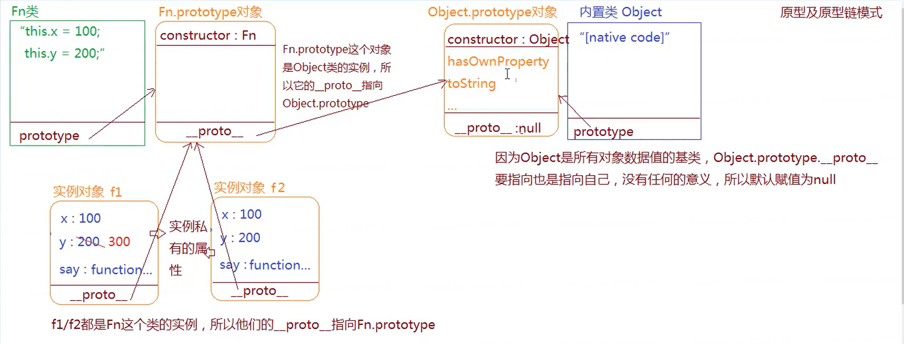
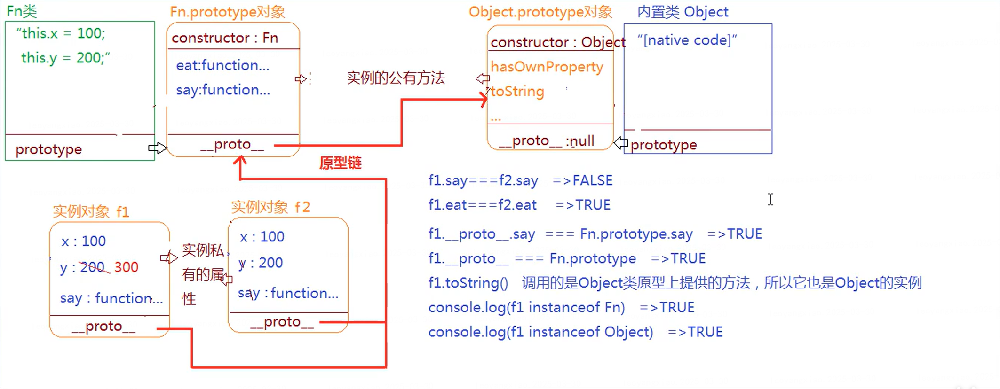
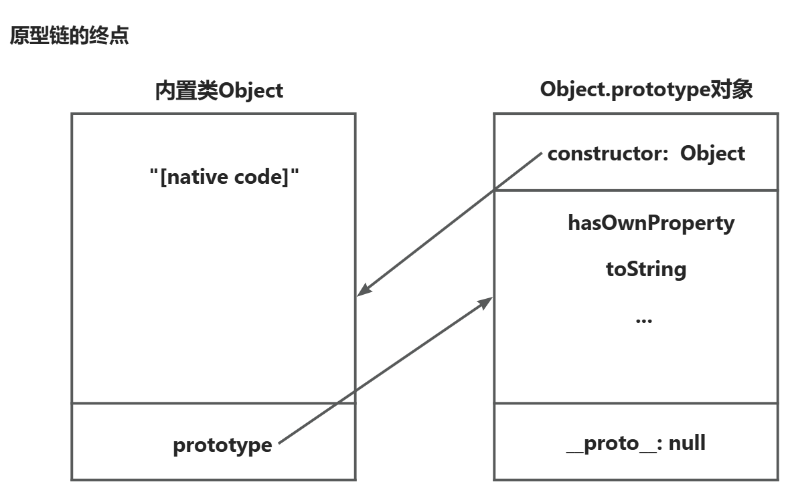

# JavaScript 笔记

[TOC]

## 宏任务与微任务

- js 中，代码会被划分成**宏任务** (macro-task) 和**微任务** (micro-task),其中，**宏任务包括：整体代码 script, setTimeout, setInterval，requestAnimationFrame，ajax 请求，用户交互事件(DOM 事件)**; **微任务包括：Promise.then .catch 和 .finally、process.nextTick**

---

- js 代码的执行机制：执行一个宏任务过程中，如果遇到微任务，就将其放到微任务的事件队列中，当遇到宏任务时，则会把宏任务放在宏任务的事件队列。 当前的**宏任务执行结束时**，**就会查看微任务的事件队列，并将里面的所有微任务依次执行完，再执行下一个宏任务**。如此循环，就形成 js 的**事件循环**机制(Event Loop)

> > 冷知识：当宏任务队列里面**既有定时器任务又有用户交互事件任务**时，**用户的交互操作总是被优先执行**

---

- 什么时候加入队列：JS 异步的实现靠的就是浏览器的多线程，当他遇到异步 API 时，就将这个任务交给对应的线程，当这个**异步 API 满足回调条件时，对应的线程又通过事件触发线程将这个事件放入任务队列**，然后主线程从任务队列取出事件继续执行===>**当主线程执行完成后，查看是否有微任务在队列中(当然这个异步 API 是要满足回调条件的)**

---

- 重点：
  1.new Promise 中的函数都是同步的,立即执行; 2.当我们第一次执行的时候，解释器会将整体代码 script 放入宏任务队列中，因此事件循环是从第一个宏任务开始的； 3.如果在执行微任务的过程中，产生新的微任务添加到微任务队列中，也需要一起清空；微任务队列没清空之前，是不会执行下一个宏任务的。

```js {.font}
console.log(1);
setTimeout(function () {
  console.log(2);
  let promise = new Promise(function (resolve, reject) {
    console.log(7);
    resolve();
  }).then(function () {
    console.log(8);
  });
}, 1000);
setTimeout(function () {
  console.log(10);
  let promise = new Promise(function (resolve, reject) {
    console.log(11);
    resolve();
  }).then(function () {
    console.log(12);
  });
}, 0);
let promise = new Promise(function (resolve, reject) {
  console.log(3);
  resolve();
})
  .then(function () {
    console.log(4);
    Promise.resolve().then(() => {
      console.log(5);
    });
  })
  .then(function () {
    console.log(9);
  });
console.log(5);
```

- **执行顺序**

1. 执行同步任务 console.log(1) ,输出 1
2. 遇到 setTimeout 放到宏任务队列中，命名 time1
3. 遇到 setTimeout 放到宏任务队列中，命名 time2
4. new Promise 在实例化过程中所执行的代码都是同步执行的（function 中的代码），输出 3
5. 将 Promise 中注册的回调函数放到微任务队列中，命名为 then1 ==（因为满足回调条件）==
6. ==将 Promise 中注册的回调函数放到微任务队列中，命名为 then2（错）==，**因为此时异步 API 不满足回调条件，并不会放入微任务队列中，只会将这个任务交给对应的线程**
7. 执行同步任务 console.log(5),输出 5 //主线任务结束--->微任务
8. 从微任务队列取出任务 then1 到主线程中，输出 4
9. then1 微任务执行又产生新的微任务 Promise.resolve().then(()=>{console.log(5)})加入队列，则会继续执行微任务
10. 微任务 Promise.resolve().then(()=>{console.log(5)})执行完成，又有 then2 加入微任务队列，则继续执行微任务 then2
11. 从宏任务队列中取出 time2(注意这里不是 time1 的原因是 time2 的执行时间为 0)
12. 执行同步任务 console.log(10),输出 10
13. new Promise 在实例化过程中所执行的代码都是同步执行的（function 中的代码），输出 11
14. 将 Promise 中注册的回调函数放到微任务队列中，命名为 then3，至此宏任务 time2 执行完成
15. 从微任务队列取出任务 then3 到主线程中，输出 12，至此微任务队列为空
16. 从宏任务队列中取出 time1，至此宏任务队列为空
17. 执行同步任务 console.log(2),输出 2
18. new Promise 在实例化过程中所执行的代码都是同步执行的（function 中的代码），输出 7
19. 将 Promise 中注册的回调函数放到微任务队列中，命名为 then4，至此宏任务 time1 执行完成
20. 从微任务队列取出任务 then3 到主线程中，输出 8，至此微任务队列为空

---

---

---

---

---

---

## 浏览器多线程

- 1.JS 引擎线程--**与 GUI 线程是互斥**：
  JS 引擎线程（JS 内核）(单线程)：负责处理 JavaScript 脚本，运行代码，JS 引擎值等待着任务队列中的任务的到来，然后再处理，一个 tab 页中无论什么时候都只有一个 JS 线程在运行 JS 程序

---

- 2.GUI 渲染线程：
  负责渲染浏览器界面，包括解析 HTML、CSS、构建 DOM 树、Render 树、布局与绘制等
  当界面需要重绘（Repaint）或由于某种操作引发回流(reflow)时，该线程就会执行

---

- 3.事件触发线程：用来控制事件循环，当 JS 引擎执行代码块时，会将对应的任务添加到事件线程中，当对应的事件符合触发条件被触发时，该线程会把事件添加到待处理队列的队尾，等待 JS 引擎处理

---

- 4.定时器触发线程：setInterval 与 setTimeout 所在线程，浏览器定时计数器并不是由 JS 引擎计数的，因为 JS 引擎是单线程的，如果处于阻塞线程状态就会影响计时的准确因此通过单独的线程来计时并触发定时。W3C 在 HTML 标准中规定，规定要求 setTimeout 中低于 4ms 的时间间隔算为 4ms。（也就是 0ms 也算 4ms）；

---

- 5.异步 http 请求线程：在 XMLHttpRequest 连接后是通过浏览器新开的一个线程请求，检测到状态变更时，如果设置有回调函数，异步线程就产生状态变更事件，将这个回调放入事件队列中，等待 JS 引擎的执行

---

- 注意：**当 js 操作 DOM 时，宏任务执行完毕后，立即执行当前微任务队列中的所有微任务（依次执行）当前宏任务执行完毕，开始检查渲染，然后 GUI 线程接管渲染渲染完毕后，JS 线程继续接管，开始下一个宏任务（从事件队列中获取）**

---

---

---

---

## 数组常用的操作方法

?代表可选，thisValue 代表执行 callback 时，用于 this 的值。

1. push() 将一个或**多个**元素添加到数组的末尾，**返回该数组的新长度** **_此方法修改原数组_**
   &nbsp;
2. pop() 从数组中删除最后一个元素，**返回该元素的值** 如果数组为空，则返回 undefined **_此方法修改原数组_**
   &nbsp;
3. shift() 从数组中删除第一个元素，**返回该元素的值** **_此方法修改原数组_**
   &nbsp;
4. unshift() 将一个或**多个**元素添加到数组的开头，**返回该数组的新长度** **_此方法修改原数组_**
   &nbsp;
5. splice(start,**deleteCount?**,item1?) ，删除并添加元素，**返回数组[被 delete 的元素]** **_此方法修改原数组_**
   &nbsp;
6. sort() 对数组的元素进行排序 **返回排序后的数组(该数组)** **_此方法修改原数组_**
   &nbsp;
7. reverse()，将数组中元素的位置颠倒，**返回颠倒后的数组(该数组)** **_此方法修改原数组_**
   &nbsp;
8. forEach(function(currentValue，index?,array?),\[, thisValue])?)，遍历数组 **返回 undefined** **_在回调函数通过 arr[index]修改数组_**
   &nbsp;
9. map(function(currentValue，index?,array?),\[, thisValue])?)，创建一个新数组，**返回数组[回调函数中的返回值]** **_在回调函数通过 arr[index]修改数组_**
   &nbsp; >>map 与 forEach 的区别：
   1、map 有**返回值**，可以开辟新空间，return 出来一个**length 和原数组一致的数组**，即便数组元素是 undefined 或者是 null。**forEach 默认无返回值**，**返回结果为 undefined**，
   2、**都可以通过在函数体内部使用索引修改数组元素**
   3、**map 的处理速度比 forEach 快**,而且返回一个新的数组，**方便链式调用其他数组新方法**，比如 filter、reduce let arr = [1, 2, 3, 4, 5]; let arr2 = arr.map(value => value \* value).filter(value => value > 10); // arr2 = [16, 25]

10. filter(function(currentValue,index?,arr?), \[, thisValue])?)，创建一个新的数组，**返回数组[满足回调函数条件的 value]**
    &nbsp;
11. find(function(currentValue,index?,arr?), \[, thisValue])?)，**返回满足条件的第一个元素的值或者返回 undefined**
    &nbsp;
12. every(function(currentValue,index?,arr?), \[, thisValue])?)，数组内的所有元素是否都能满足条件 **返回一个布尔值(数组为空，返回 true)**
    &nbsp;
13. some(function(currentValue,index?,arr?), \[, thisValue])?)，数组内是否至少有 1 个元素满足条件 **返回的是一个布尔值(数组为空，返回 false)**
    &nbsp;
14. flat(depth=1?)，**返回展开层数为 depth 的新数组**
    &nbsp;
15. concat()，合并两个或**多个**数组 **返回合并后的新数组**
    &nbsp;
16. slice(begin?默认 0,end?默认数组长度)，**返回新数组[arr[begin]···arr[end-1]]**
    &nbsp;
17. join(c)，**返回字符串 str=value0+c+value1+c···**
    &nbsp;
18. includes(valueToFind[, fromIndex])，方法用来判断一个数组是否包含一个指定的值，**返回一个布尔值**

- **总结：1-7 修改数组 8-13 遍历数组 展开、合并、剪切、转字符串 （indexof() at() fill() reduce((previousValue, currentValue, [currentIndex[, array]]) => { }, [initialValue]) ）**

---

---

---

## 数组内置方法 Array.xxx

1. **Array.from() 返回一个类似数组或可迭代对象的浅拷贝的数组实例**

2. Array.isArray() 用于确定传递的值是否是一个 Array **返回 Boolean**

## 可迭代对象

- 要成为可迭代对象,一个**对象必须实现 @@iterator 方法**。这意味着对象（或者它原型链上的某个对象必须有**一个键为 @@iterator 的属性，可通过 iterableObj\[Symbol.iterator]访问该属性,属性值为一个函数**
  &nbsp;

- JS 内置的可迭代对象： **Array---String---Set---Map---类数组**(拥有一个 length 属性和若干索引属性的任意对象)
  &nbsp;

- **迭代器:**&nbsp;JS 规定，如果一个对象具有 next 方法，并且该方法返回一个对象，该对象的格式如{value:xxx,done:boolean}，则认为该对象是一个迭代器
  **next 方法**：用于得到下一个数据
  **返回的对象**：value——下一个数据的值；done——boolean，是否迭代完成

```js {.font}
let iter = {
  i: 0,
  next() {
    if (this.i > 10) return { done: true };
    return { value: this.i++ };
  },
  //让迭代器的迭代器接口返回自身
  [Symbol.iterator]() {
    return this;
  },
};

//这样，你就可以把迭代器用在任何可迭代对象的地方
for (let i of iter) {
  console.log(i);
}
```

---

> > **访问可迭代对象(也可以说访问迭代器)**
> >
> > - Array.from(iterable)
> > - for...of 循环 （for...in**任意顺序**迭代一个对象(**可迭代对象+普通对象**)的除 Symbol 以外的**可枚举**属性，包括继承的可枚举属性）
> > - 数组解构 let [a,b,...c]=iterableObj **_所以所有的可迭代对象都可以解构赋值_**
> > - 扩展操作符 ···
> > - new Map([iterable]) new Set([iterable])
> > - Promise.all(iterable) Promise.race(iterable)

---

---

---

## 字符串常用的操作方法

1. toLowerCase()，把字符串转为小写，**返回新的全小写字符串** **_此方法不改变原数组_**

2. toUpperCase()，把字符串转为大写，**返回新的全大写字符串** **_此方法不改变原数组_**

3. charAt(index)，**返回指定下标位置的字符或者空字符串**

4. charCodeAt(index)，**返回指定下标位置的字符的 unicode 编码或者 NaN**

5. indexOf('str')，**返回子字符串‘str’第一次出现的位置或者-1**

6. lastIndexOf()，**返回子字符串‘str’在字符串中最后出现的位置或者-1**

7. includes(searchString[, startIndex]) 判断 searchString 是否在字符串中 **返回 Boolean**

8. slice(beginIndex[, endIndex])，**返回字符串中提取的子字符串(规则同数组方法)**

9. substring(indexStart[, indexEnd])，**返回字符串中提取的子字符串(index>=0)** **_此方法不改变原字符串_**

10. concat(str2, [, ...strN])，**返回合并后的字符串** **_此方法不改变原字符串_**

11. split(separator)，**返回一个数组[用 separator 分割切开后]**
    q
12. trim()，**返回删除两端空白字符的字符串** **_此方法不改变原字符串_**

13. replace(regexp|substr, newSubStr|function)，**返回一个替换后的新字符串，如果参数 1 是字符串，则仅替换第一个匹配项**

14. match(regexp)，**返回一个字符串匹配正则表达式的结果** 如果正则使用 g 标志，则将返回与完整正则表达式匹配的所有结果，但不会返回捕获组；否则，则仅返回第一个完整匹配及其相关的捕获组（Array）

- **总结：JS 的字符串是不可变的（immutable），String 类定义的方法都不能改变字符串的内容，上述返回的是全新的字符串，而不是修改原始字符串**

---

---

---

---

---

## Object 实例方法

- .hasOwnProperty(key) ，**返回一个布尔值**，判断**对象自身属性**中是否具有指定的属性（**指定的 key--字符串形式**）

- A.isPrototypeOf(B) ，**返回一个布尔值**，用于判断一个对象是否存在于另一个对象的原型链----->`return A===B.__proto__[.__proto__]?true:false:`

  > 注:与 instanceof 的区别:在表达式 "A instanceof B"中，`return Object.getPrototypeOf(A)===B.prototype[.prototype]?true:false:`

- .valueOf()，**返回指定对象的原始值**
- .toString()，**返回一个表示该对象的字符串**

---

---

---

## Object 内置方法 Object.xxx

- Object.getPrototypeOf() **返回参数对象的原型** **这是获取原型对象的标准方法**

- Object.assign(target, ...sources) 从一个或多个源对象的将所有可枚举属性--值分配到目标对象 **返回 target 目标对象**

- Object.create(proto，[propertiesObject]) **返回一个新对象** 新对象的原型为 proto; 新对象有和 propertiesObject 一样的属性--值

```js {.font}
//手写Object.creat
//Object.prototype.__proto__
//已废弃: 该特性已经从 Web 标准中删除，虽然一些浏览器目前仍然支持它，但也许会在未来的某个时间停止支持，请尽量不要使用该特性。
function objCreat(obj) {
  let newobj = {};
  newobj.__proto__ = obj;
  return newobj;
}
//最好这样写
Object.create = function (o) {
  var F = function () {};
  F.prototype = o;
  return new F();
};
```

- Object.keys()， **返回数组[自身可枚举属性]**，数组中属性名的排列顺序和正常循环遍历该对象时返回的顺序一致(不走原型链)

- Object.values() ，**返回数组[对象自身可枚举属性值]**，值的顺序与使用 for...in 循环的顺序相同(不走原型链)

<section aria-labelledby="统计表"><h2 id="统计表"><a href="#统计表" title="Permalink to 统计表">统计表</a></h2><div class="section-content"><div class="table-scroll"><table>
  <thead>
    <tr>
      <th></th>
      <th><code>in</code></th>
      <th><code>for..in</code></th>
      <th><code>obj.hasOwnProperty</code></th>
      <th><code>obj.propertyIsEnumerable</code></th>
      <th><code>Object.keys</code></th>
      <th><code>Object.getOwnPropertyNames</code></th>
      <th><code>Object.getOwnPropertyDescriptors</code></th>
      <th><code>Reflect.ownKeys()</code></th>
    </tr>
  </thead>
  <tbody>
    <tr>
      <td>自身的可枚举属性</td>
      <td>true</td>
      <td>true</td>
      <td>true</td>
      <td>true</td>
      <td>true</td>
      <td>true</td>
      <td>true</td>
      <td>true</td>
    </tr>
    <tr>
      <td>自身的不可枚举属性</td>
      <td>true</td>
      <td>false</td>
      <td>true</td>
      <td>false</td>
      <td>false</td>
      <td>true</td>
      <td>true</td>
      <td>true</td>
    </tr>
    <tr>
      <td>自身的 Symbol 键</td>
      <td>true</td>
      <td>false</td>
      <td>true</td>
      <td>true</td>
      <td>false</td>
      <td>false</td>
      <td>true</td>
      <td>true</td>
    </tr>
    <tr>
      <td>继承的可枚举属性</td>
      <td>true</td>
      <td>true</td>
      <td>false</td>
      <td>false</td>
      <td>false</td>
      <td>false</td>
      <td>false</td>
      <td>false</td>
    </tr>
    <tr>
      <td>继承的不可枚举属性</td>
      <td>true</td>
      <td>false</td>
      <td>false</td>
      <td>false</td>
      <td>false</td>
      <td>false</td>
      <td>false</td>
      <td>false</td>
    </tr>
    <tr>
      <td>继承的 Symbol 键</td>
      <td>true</td>
      <td>false</td>
      <td>false</td>
      <td>false</td>
      <td>false</td>
      <td>false</td>
      <td>false</td>
      <td>false</td>
    </tr>
  </tbody>
</table></div></div></section>
----
----
----

## 用运算符来理解隐式转换(==类型不一致才会转换==)

> > 隐式转换：在 js 中，当运算符在运算时，如果**两边数据类型不统一**，编译器会自动将运算符两边的数据做一个数据类型转换，转成一样的数据类型再计算。

- **\+运算符**:加法运算的规则很简单，只会触发两种情况 **① string + string ② number + number**，只有+运算符才可能把数值转成字符串

> > - 当有任一操作数为字符串、对象时==>进行字符串拼接，使用\[Symbol.toPrimitive]()\==>valuOf()\==>toString()转换为字符串，对于 null 与 undefined 则使用 String()转换
> > - 当操作数为 boolean null undefined 简单数据类型时==>用 Number()转换为数字，进行数值运算

- **关系运算符**(><,>=<=>)，隐式转换只会触发两种情况 **① string 比较 string ② number 比较 number**

> > - 当有任一操作数是数值、Boolean、null、undefined 时==>进行数值比较
> > - 当有任一操作数为对象时，进行\[Symbol.toPrimitive]()\==>valuOf()\==>toString()==>Number()转换至两端类型一致，进行字符串比较或数值比较
> > - 若出现 NaN 则返回 false

- **相等操作符(== !=)**，隐式转换只会触发两种情况 **① string 比较 string ② number 比较 number**

> > - 当有任一操作数是数值、Boolean 时==>进行数值比较
> > - 当有任一操作数为对象时，进行\[Symbol.toPrimitive]()\==>valuOf()\==>toString()==>Number()转换至两端类型一致
> > - 若出现 NaN 则返回 false
> >   唯一与关系运算符不同的是==null 与 undefined 不进行类型转换且 null\==undefined==

- 逻辑非运算符(!，!!) 转成 Boolean(只有六个为 false)

> > 问题：一个对象 obj\==0，问该对象可能是什么？
> > 规则：当有任一操作数是数值、Boolean 时==>进行数值比较；所以要把对象变为数值，先.valuOf()若为基本类型则比较，若不是则进.toString()，再将 String 转为 Number
> > 则可能的情况有:
> >
> > - **[ ],**
> > - **new String(无/0/''/[ ]/['']/[0]/[undefined]/[null]....),**
> > - **new Number(无/0/''/[ ]/['']/[0]/[undefined]/[null]....),**
> > - **new Object(0/''/[ ]/['']/[0]/[undefined]/[null]....),**
> > - **扩展:一个对象**
> > - **{**
> > - **&nbsp;\[Symbol.toPrimitive](hint){**
> > - **&nbsp;&nbsp;switch(hint){**
> > - **&nbsp;&nbsp;case 'number':return 0**
> > - **&nbsp;&nbsp;case 'default':return 0**
> > - **&nbsp;&nbsp;case 'string':return '';**
> > - **&nbsp;&nbsp;}**
> > - **&nbsp;}**
> > - **}**
> > - **特别的：数组中的 undefined 与 null 在 toString()的时候当作''空;**

```js {.font}
[null, null].toString() == ",";
[undefined, undefined].toString() === ",";
[null] == "";
[null] == 0;
[undefined] == "";
[undefined] == 0;
```

## Number/String/Boolean

- **Number/String 对象**是经过封装的能让你处理数字值的**对象**。Number/String 对象由 Number()/String()构造器创造。注意：**n**umber/**s**tring 是基本数据类型

- 使用 Number
  1、Number(xxx)

  > > Number(str);Number(arr);Number(obj)

  2、构造函数，构造 Number 对象

  > > var a=new Number(xxx);
  > > a.valueOf();

  注意:当**参数为对象类型**时：会自动调用\[Symbol.toPrimitive]('number')\==>valuOf()\==>toString()直至得到一个 string 或 number
  特殊的：**Number(null)\==0 ;Number(undefined)==>NaN**

- 使用 String 类似 Number

## 对象转基本数据类型

**_进行\[Symbol.toPrimitive]()\==>valuOf()\==>toString()==>Number()_**
依次执行上述四个方法，当获取到基本数据类型是执行终止

- **1、Symbol.toPrimitive**(js 内置只有 Date 对象有此属性)

```js {.font}
var obj = {
  [Symbol.toPrimitive](hint) {
    if (hint == "number") {
      return 10;
    }
    if (hint == "string") {
      return "hello";
    }
    return true;
  }
};
console.log(+obj);     // 10      -- hint 参数值是 "number"
console.log(`${obj}`); // "hello" -- hint 参数值是 "string"
console.log(obj + ""); // "true"  -- hint 参数值是 "default"

obj==?10;  obj==?1;
```

**_注意：隐式类型转换 hint 参数为 default_**

- **2、valueOf()**
  函数返回**对象**的原始值

  > > Array,Object,Function 返回其**本身**&nbsp;即**obj.valueOf()===obj**
  > > Number 对象/String 对象/Boolean 对象返回其 number，string，boolean 基本数据类型，即构造函数经过类型转化后的入口参数

- **3、toString()**
  调用各自**对象原型方法 Array/Object/Function···.prototype.toString()**,**返回一个字符串**

  > > arr.toString()，相当于 arr.join(',');
  > > obj.toString(),==>'[object Object]';

  **注意：可以用 Object.prototype.toString;检测对象类型**

  ```js {.font}
  Object.prototype.toString.call(new Date()); // [object Date]
  Object.prototype.toString.call(new String()); // [object String]
  Object.prototype.toString.call(Math); // [object Math]
  Object.prototype.toString.call(undefined); // [object Undefined]
  Object.prototype.toString.call(null); // [object Null]
  ```

## 递归的尾调优化

- 尾调用:**就是指某个函数的最后一步是调用另一个函数**

  > > 单纯的一个函数：g(x)+1 不算、let y = g(x); return y；也不算

- 函数调用自身，称为递归。如果尾调用自身，就称为尾递归

  > > 递归非常耗费内存，因为需要同时保存成千上百个调用记录，很容易发生"栈溢出"错误（stack overflow）。但对于尾递归来说，由于只存在一个调用记录，所以永远不会发生"栈溢出"错误

- 注意：ES6 的尾调用优化只在**严格模式下开启，正常模式是无效的**
  > > 因为这是因为在正常模式下，函数内部有两个变量，可以跟踪函数的调用栈。
  > > arguments：返回调用时函数的参数。
  > > func.caller：返回调用当前函数的那个函数。
  > > 尾调用优化发生时，函数的调用栈会改写，因此上面两个变量就会失真。严格模式禁用这两个变量，所以尾调用模式仅在严格模式下生效

## Generator(生成器)

- 生成器的形式是一个**函数**，函数名称前面**加一个星号\*表示它是生成器**，只要是可以定义函数的地方就可以定义生成器。**(箭头函数不能用来定义生成器)**
  &nbsp;
- **调用生成器函数会产生一个生成器对象**,生成器对象一开始处于暂停执行(suspended)的状态。

---

- yield 关键字：

  > 生成器函数在**遇到 yield 关键字之前会正常执行**，遇到这个**关键字之后，执行会停止**，函数作用域的状态会被保留。执行停止的生成器函数**只能通过 next()方法来恢复执行**，yield 关键字**只能在生成器函数中使用**。
  > &nbsp;
  > 语法：**yield [expression]**
  > yield 关键字实际返回一个 IteratorResult 对象，它有两个属性，value 和 done。**value 为 expression 的结果**，而**done 是 false**，表示生成器函数**尚未完全完成** > &nbsp; > **注意:通过 yield 关键字退出的生成器函数会处在 done:false 状态(即返回的 IteratorResult 对象的 done 属性值为 false)；而通过 return 退出则会处于 done：true 的状态，且生成器对象状态为 closed** > &nbsp;

- 方法：

  > > **Generator.prototype.next()\***,用这个方法会让生成器开始或恢复执行。
  > > 方法返回一个带有**value 属性**和**done 属性**的**对象**，**value 属性**是生成器**函数的返回值**，默认为 undefined；**done 属性**值类型为 Boolean，当**函数执行完毕为 true，其余都为 false** > > **_注意： 生成器函数只会在初次调用 next()方法后开始执行_**

  ```js {.font}
  fuction* generatorfn(){
    console.log('foobar');
  }
  let obj=generatorfn();//此时不打印‘foobar’
  obj.next();//现在才打印‘foobar’
  ```

  > > **Generator.prototype.return()**，方法会强制生成器进入**关闭状态**(\<closed>)，提供给 return(a)方法的值 a 就是终止生成器对象的值,方法**返回一个对象{value:a,done:true}**；关闭后使用 next()方法返回{value:undefined,done:true}

  &nbsp;

  > > **Generator.prototype.throw(a)**,方法用来向生成器抛出异常,如果错误未被处理，生成器就会关闭；如果生成器函数内部处理了这个错误，生成器恢复执行，错误会跳过对应的 yield
  > > **注意：如果生成器对象没有开始执行就.throw()，则不会在函数内部被捕获，相当于在函数块外抛出了个错误**

&nbsp;

1、生成器对象作为可迭代对象：

```js {.font}
function* generatorfn() {
  yield 1;
  yield 2;
  yield 3;
}
for (const x of generatorfn()) {
  console.log(x);
}
let [a, b, c] = generatorfn();
```

2、使用 yield 实现输入输出：上一次让生成器函数暂停的 yield 关键字会接收到传给 next()方法的第一个值
注意：第一次 next()传入的值不会被使用，因为第一次调用是为了开始执行生成器函数

```js {.font}
function* generatorfn() {
  console.log(initial);
  console.log(yield);
  console.log(yield);
}
let obj = generatorfn("foo");
obj.next("first"); //‘foo’
obj.next("tom"); //‘tom’
obj.next("jerry"); //‘jerry’
```

3、把生成器作为默认的迭代器

```js {.font}
class foo {
  value = [1, 2, 3]; //等于号相当于this.state=[1,2,3]
  *[Symbol.iterator]() {
    yield this.value;
  }
}
const [a, b, c] = new foo();
```

4、产生可迭代对象：可以使用星号(\*)增强 yield 的行为，让它能够迭代一个可迭代的对象，从而一次产出 1 个值

```js {.font}
function* generatorfn() {
  yield* [1, 2, 3];
}
const [a, b, c] = generatorfn();
```

5、使用 yield 实现递归

## Class 类

```js {.font}
class subType extends superType {
  constructor() {
    //使用new操作符时会调用constructor函数
    super(); //调用父类构造函数
    this.name = "subType"; //不能在super之前引用this
  }
  get area() {
    //定义在原型上
    return this.height * this.width;
  }
  state = [1, 2, 3, 4]; //相当于this.state=[1，2，3，4]
  static fn() {} //定义在类本身上
}
```

- **实例化**：使用 new 调用类的构造函数会执行如下操作。

> > 1、在内存中**创建一个新对象**
> > 2、这个**新对象内部的\[\[Prototype]]指针被赋值为构造函数的 prototype**类型。
> > 3、**构造函数中内部的 this，被赋值为这个新对象**。
> > 4、**执行**构造函数内部的代码(给新对象添加属性)
> > 5、**如果构造函数没有返回对象，则返回刚创建的新对象**。

- **继承**:主要做了三件事：
  1、调用父类构造函数产生父类实例，创建 this，并在后续添加上子类相关属性
  2、利用 Object.create()方法基于**父类原型对象创建一个新对象**，且设置**该对象的 constructor 属性指向子类构造函数**，并将该**对象赋值为子类的原型对象**
  3、**将子类构造函数的**proto**属性赋值为父类的构造函数**
  > > const a=new subType():有
  > > **1、a.\_\_proto\_\_===subType.prototype** > > **2、subType.prototype.\_\_proto\_\_===superType.prototype;** > > **_3、subType.\_\_proto\_\_===superType_**

## Set

- **Set 对象允许你存储任何类型的唯一值，无论是原始值或者是对象引用**

---

- **基本 API**

  1、使用**new 关键字和 Set 构造函数**可以创建一个空集合

  > > const m=new Set();
  > > 也可以给 Set 构造函数传入一个可迭代对象， const s1=new Set(iterable)
  > > &nbsp;

  2、.add()增加，.has()查询，通过 size 取得元素数量，以及使用.delete()和.clear()删除元素
  &nbsp;

  3、顺序和迭代：.values()/.keys()\==>value，.entries()==>[value,value]，.forEach()；应用：数组去重，实现并集（Union）、交集（Intersect）和差集（Difference）

## WeakSet

WeakSet 结构与 Set 类似，也是不重复的值的集合，WeakSet 的成员只能是对象，而不能是其他类型的值

- **基本 API：add，delete，has；只有三个方法，没有属性**
- 解释：Weak set 中的'Weak'表示弱集合的值是“弱弱地拿着”的，意思就是这些值不属于正式的引用，**不会阻止垃圾回收**，也就是说，如果**其他对象都不再引用该对象**，那么垃圾回收机制会自动回收该对象所占用的内存，不考虑该对象是否还在该弱引用的结构中。
  **注意： 弱引用的对象不可遍历！**

## WeakMap

**WeakMap 对象**是一组键/值对的集合，其中的**键是弱引用**的。**其键必须是对象，而值可以是任意的**

## <a href='https://segmentfault.com/a/1190000017075730'>This</a>

> > **_this 的指向不是在编写时确定的,⽽是在执行时确定的_**

1.给元素的某个事件绑定方法，**当元素触发方法执行**时，**方法中的 this 就是当前操作的元素本身**

```js {.font}
//思考：各个this是怎样的
document.body.addEventListener("click", event());
function event() {
  console.log("绑定", this);
  return function () {
    console.log("返回", this);
    fn();
  };
}
function fn() {
  console.log(this);
}
```

2.当函数方法执行时，看方法**前面有没有点(.)**：若无：则严格模式下 this 为 undefined，非严格模式下为 window；若有则点前面是谁 this 就是谁

```js {.font}
var name = "global";
function fn() {
  console.log(this.name);
}
var obj = {
  name: "loacal",
  fn,
};
obj.fn();
fn();
```

3.在构造函数模式执行中，函数体中的 this 是当前类实例

```js {.font}
//思考：各个this是怎样的
function fn() {
  console.log(this);
}
fn();
new fn();
```

**_补充：_**

```js {.font}
var obj = {
  name: "local",
  foo: function () {
    this.name = "foo";
  }.bind(window),
};
var bar = new obj.foo();
//new绑定的优先级大于bind绑定(bind绑定属于硬绑定)，所以new函数方法执行时的this还是指向new出来的新对象
```

4.使用**call，apply，bind 来改变 this 指向**
&nbsp; 5.箭头函数中的 this：没有自己的 this，箭头函数的 this 为箭头函数**定义时所在的函数作用域所指向的 this**，如果这个函数作用域的 this 是动态的，那箭头函数的 this 也是动态的。
（**箭头函数没有自己的 this 值，箭头函数中所使用的 this 来自于函数作用域链**）

```js {.font}
//1、在普通对象中
如果箭头函数外层没有普通函数，无论严格模式还是宽松模式，它的this都会指向window(全局对象)，而普通函数严格模式下this为undefined
let obj1={
  fn:()=>console.log(this)
}
obj1.fn();
<============比较两个区别==============>
const obj = {
  aaa(){
  let obj1={
  fn:()=>console.log(this),
  }
  obj1.fn();
  }
}
obj.aaa();    //箭头函数this为所在函数作用域中的this

//2、在构造函数模式执行中
箭头函数的this为所在函数作用域中的this，即为构造函数函数fn执行时候的this，因此这个this是动态的，因为new fn()的时候，this为新创建的对象
function fn(){
  this.arrow=fucntion(){
    setTimeout(()=>console.log(this),500);
  }
}
new fn().arrow();
//3、在class中,在React中事件绑定函数执行时默认的this为undefined(与原生事件不同)，
//要想在事件触发时获取组件实例，所以用箭头函数，
//因为ReactDom.render()的时候new React(),箭头函数定义时所在函数作用域里面的this为new的实例对象
class React{
  arrow=()=>{console.log(this.state.name);
  }
  state={
    name:'xy',
  }
}
new React().arrow();
```

## <a href='https://juejin.cn/post/6844903805960585224'>箭头函数与普通函数的区别</a>

- 箭头函数不会创建自己的 this
- call()/.apply()/.bind()无法改变箭头函数中 this 的指向
- 箭头函数不能作为构造函数使用
  > > <a href='https://juejin.cn/post/7050492355056664612#heading-2'>深入理解箭头函数为什么不能做构造函数</a>
- 箭头函数没有自己的 arguments
- 箭头函数没有原型 prototype
- 箭头函数不能用作 Generator 函数，不能使用 yeild 关键字

## Promise

**_Promise 的状态一经改变就不能再改变_**

- 静态方法(1-4 重点、5-6 了解)
  1、_Promise.all(iterable)_

  > > 方法返回一个新的 promise 对象，等到所有的 promise 对象都成功或有任意一个 promise 失败
  > > &nbsp;
  > > 如果所有的 promise 都成功了，它会把一个包含 iterable 里所有 promise 返回值的数组作为成功回调的返回值。顺序跟 iterable 的顺序保持一致
  > > &nbsp;
  > > 一旦有任意一个 iterable 里面的 promise 对象失败则立即以该 promise 对象失败的理由来拒绝这个新的 promise

  2、_Promise.race(iterable)_

  > > 方法返回一个新的 promise 对象,等到任意一个 promise 的状态变为**已敲定(非 pending 状态)**
  > > 返回的 Promise 对象的状态与 iterable 中的第一个已敲定状态一致，其值也一致

  3、_Promise.reject(value)_

  > > 返回`Promise {\<rejected>: value}`

  4、Promise.resolve(value)

  > > 方法返回一个以给定值解析后的新 Promise 对象
  > > **如果这个值是一个 promise ，那么将返回这个 promise** > > **否则返回的 promise 将以此值完成(fullfilled 状态)**此函数将类 promise 对象的多层嵌套展平。
  > > 了解：如果这个值是 thenable（即带有 "then" 方法），返回的 promise 会“跟随”这个 thenable 的对象，采用它的最终状态；

  5、Promise.any(iterable)

  > > 方法返回一个新的 promise 对象,等到任意一个 promise 的状态变为 fullfilled 状态，此时返回一个 fullfilled 状态的 Promise 其值为**第一个成功**的 Promise 的值
  > > 若 iterable 中的 promise 全被 rejecte 了，则返回 **_Promise {\<rejected>: AggregateError: All promises were rejected}_**

  6、Promise.allSettled(iterable)

  > > 等到所有 promise 都已敲定（每个 promise 都已兑现或已拒绝）
  > > 返回一个 promise，该 promise 在所有 promise 都敲定后完成，并兑现一个对象数组，其中的对象对应每个 promise 的结果

- 实例方法
  1、**Promise.prototype.then**

  > > - 如果 then(...)执行返回值是一个非 Promsie 类型的数据(return 520;)，则 then(...)函数执行返回 Promsie{state：fulfilled，value：520}
  > > - 如果 then(...)执行返回值是一个 Promsie 对象，则 then(...)函数执行返回一个 Promise 对象，其状态取决于 return 的‘Promsie’对象的状态;返回的 Promise 的值也就是 return ‘Promsie’的值
  > > - then(...)执行报错，则会返回一个 Promsie{state：rejected，value：错误原因}
  > >   **_补充：返回一个 promise 的好处：方便链式调用(数组方法 map 也返回一个数组，方便链式调用)_**

  2、**Promise.prototype.catch**

  > > **catch 方法是.then(null, rejection)或.then(undefined, rejection)的别名** > > &nbsp; > > **catch 能捕获的错误**有：一个 rejected 的 Promise 和**在 resolve()/reject()前面**抛出的**同步**错误

  3、Promise.prototype.finally()

  > > finally()方法返回一个 Promise。在 promise 结束时，无论结果是 fulfilled 或者是 rejected，都会执行指定的回调函数。这为在 Promise 是否成功完成后都需要执行的代码提供了一种方式。
  > > 这避免了同样的语句需要在 then() 和 catch() 中各写一次的情况

### 总结对比

1. `Promise.any`: 第一个成功或者全部失败

   ```js
   //全部失败返回
   return Promise.reject({
     errors: [1, 2],
     message: "All promises were rejected",
     stack: "AggregateError: All promises were rejected",
   });
   ```

2. `Promise.race`: 第一个敲定的
3. `Promise.all`: 全部成功或任意一个失败

   ```js
   //全部成功返回
   return Promise.resolve([1, 2, 3]);
   ```

4. `Promise.allSettled`：全部状态敲定

   ```js
   //全部敲定返回
   return Promise.resolve([{ status: "rejected" / "fulfilled", reason/value: 1 }]);
   ```

## 作用域概述

在 JavaScript 中，**作用域**决定了变量、函数或对象在代码中的可访问范围(可以这样理解：有且仅在作用域内，无论在何处声明了变量，在该作用域所有地方都能知道这个变量存在，"存在"表明 js 能够知道该变量并非为`* is not defined`)。

==**全局作用域中的 var 变量**==

```JS
//在全局作用域声明的var，能且仅能在全局作用域(相当于所有作用域了)内使用
  console.log(a); // undefined (JS知道有这个变量，但是该变量为赋于初始值)
  a = 22;
  console.log(a); // 22
  var a = 12;
  console.log(a); // 12
```

==**函数作用域中的 var 变量**==

```JS
function add() {
  console.log(a); // undefined (JS知道有这个变量，但是该变量为赋于初始值)
  if( true ){
    var a = 12; // 声明在一个块中
  }
  console.log(a); // 12
}
console.log(a) // 报错：❌a is not defined; 表明var变量有且仅能在函数作用域内访问
```

==**块级作用域中的 var 变量**==

```JS
console.log(cc) //undefined
if(true){
    var cc =100
}
// JS在其声明的块之外仍能知道其存在，所以认为var变量没有块级作用域
```

> > 补充： **块级作用域 vs. 函数作用域** : ==1.函数本身也是个块== ==2.当`let/const`变量是在某个子块内声明时，它们不会扩展到整个函数，而 `var` 则会扩展到整个函数。==

---

==**全局作用域中的 let/const 变量**==

```JS
  console.log(a); // 报错：❌a is not defined;表明其没有全局作用域
  let/const a = 22;
```

==**函数作用域中的 let/const 变量**==

```JS
function add() {
  console.log(a); // 报错：❌a is not defined;
  if( true ){
    let/const a = 12; // 声明在函数的一个块中
  }
  console.log(a); // 12
}
console.log(a) // 报错：❌a is not defined;
// 表明let/const变量没有函数作用域
```

==**块作用域中的 let/const 变量**==

```JS
function add() {
  if( true ){
    console.log(a) // 报错：❌Cannot access 'a' before initialization;
    //虽然报错了，但是表明JS已经知道在这个块中“存在”a变量了，所以我们认为其具有块级作用域，但是没有变量提升
    let/const a = 12; // 声明在函数的一个块中
    console.log(a); // 12
  }
}
//我们说 let/const 没有函数作用域，是指它们的作用域限制在块级别，
// 而不是整个函数。这种设计有助于避免变量泄漏、提高代码可维护性，
// 并减少意外覆盖变量的问题。
```

---

### 1. 全局作用域 (Global Scope)

- **定义**：在代码的最外层声明的变量或函数，不在任何函数或块内声明的变量都属于全局作用域。
- **特点**：
  - 全局作用域中的变量在整个程序中都可访问。
  - 在浏览器环境中，全局变量会挂载到全局对象 `window` 上。
  - 全局变量在整个页面生命周期内一直存在，容易造成命名冲突或意外修改。

---

### 2. 函数作用域 (Function Scope)

- **定义**：在函数内部声明的变量只在该函数内有效，外部无法访问。
- **特点**：
  - 使用 var 声明的变量具有函数作用域。
  - 变量在函数执行完毕后通常会被销毁（除非形成闭包）。

---

### 3. 块级作用域 (Block Scope)

- **定义**：在一对花括号 {} 内部声明的变量只在该代码块内有效。
- **特点**：
  - 使用 let 或 const 声明的变量具有块级作用域。
  - 块级作用域出现在代码块、循环、条件语句等中。

---

---

## var 与 let/const 的区别

1、var 有变量提升机制
2、var 允许重复声明
3、var 在全局作用域声明的变量会挂载在 window 对象上
4、let/const 产生**块级作用域**

> > js 作用域：**全局作用域**与**函数作用域**(ES5)、**块级作用域**(ES6)

5、let/const 会产生**暂时性死区**(TDZ)

> > 块级作用域中的用 let/const 声明的变量会先在作用域中被创建出来，但此时还未进行词法绑定，&nbsp;不能被访问的，如果访问就会抛出错误。
> > **从块作用域的顶部一直到变量声明完成之前，这个变量处在暂时性死区（TDZ，temporal dead zone）**

| 特性                 | var                                                                          | let                                                                       | const                                                                      |
| -------------------- | ---------------------------------------------------------------------------- | ------------------------------------------------------------------------- | -------------------------------------------------------------------------- |
| **作用域**           | 函数作用域或全局作用域                                                       | 块级作用域                                                                | 块级作用域                                                                 |
| **变量提升**         | 变量声明会提升至所在函数或全局顶部，但初始化不会提升；未赋值时为 `undefined` | 声明会提升，但不会初始化；在声明前访问会产生 ReferenceError（暂时性死区） | 声明会提升，但不会初始化；在声明前访问会产生 ReferenceError（暂时性死区）  |
| **暂时性死区 (TDZ)** | 无                                                                           | 有；在声明之前访问该变量会导致 ReferenceError                             | 有；在声明之前访问该变量会导致 ReferenceError                              |
| **重复声明**         | 在同一作用域内允许重复声明                                                   | 不允许重复声明                                                            | 不允许重复声明                                                             |
| **重新赋值**         | 允许重新赋值                                                                 | 允许重新赋值                                                              | 不允许重新赋值（基本类型）；对于对象或数组，其引用不可变，但可修改内部内容 |
| **全局对象属性**     | 在全局作用域中，使用 var 声明的变量会成为全局对象（如 window）的属性         | 不会成为全局对象的属性                                                    | 不会成为全局对象的属性                                                     |
| **常见用例**         | 用于旧代码或需要函数级作用域的场景；需要注意变量提升带来的潜在问题           | 推荐用于大多数场景，能提供更严格的块级作用域控制                          | 用于声明常量；适用于那些不需要重新赋值的值（如配置、常量等）               |

## JS 判断数据类型的方法

- typeof

  > > typeof 判断**基本数据类型可以准确的判断，除了 null**,会被判为 object 类型，因为 js 底层的数据存储，前三位表示的是数据类型，而 null 全部的位数是 0,object 类型前三位是 000，所以用 typeof 判断数据类型的时候被误判是 object 数据类型，typeof 判断**对象的数据类型**的时候只能**判断 object 和 function**两种

- Object.prototype.toString.call()

  > > 准确的判断基本数据类型和引用的数据类型,所有类型数据都能判断,记住判断结果打印为：**'[object ==A==xx]'**

- A instanceof B

  > > 基于原型链去判断,注意顺序
  > > **_Object.getPrototypeOf(A)==?B.prototype_**

- .constructor
  _原理：三种原始类型的值——数值、字符串、布尔值——在一定条件下，也会自动转为对象，也就是原始类型的“包装对象”，所以可以使用 constructor 方法_

  > > **1.null 和 undefined 没有 constructor** 2.判断数字时使用(),比如 (123).constructor 3.用 constructor 是不稳定的,当开发者**重写 prototype 后,原有的 constructor 引用会丢失**,因此，为了规范开发，**在重写对象原型时一般都需要重新给 constructor 赋值，以保证对象实例的类型不被篡改**

- Array.isArray()

- isNaN()

## JS 数组去重的方法

```js {.font}
1、 [...new Set(arr)];

2、 Array.from(new Set(arr));

3、 使用Map判断，唯一的键值

4、 if(unique.indexOf(arr[i]) == -1){
    unique.push(arr[i]);
    }

5、 arr.filter((item, index, self) => {
     return self.indexOf(item) === index;
     }
    )

6、 if(!unique.includes(arr[i]))
        unique.push(arr[i]);
```

## 正则表达式

正则表达式是用于匹配字符串中字符组合的模式。在 JavaScript 中，正则表达式也是对象。这些模式被用于 RegExp 的**exec 和 test**方法，以及 String 的 **match**、matchAll、**replace**、search 和 split 方法

补充

> > **非全局的正则匹配下，match 和 exec 的返回结果是一致的，但在全局匹配的情况下，match 返回结果集数组，exec 返回每一项匹配结果的详细信息，但如果需要所有的返回结果，则需要循环调用该方法 reg.exec(str)=>必须是以字面量形式**

- 创建方式

```js {.font}
let reg = /\d+/; //字面量创建方式（两个斜杠之间包起来的，都是用来描述规则的元字符）
let reg2 = new RegExp("\\d+"); //构造函数模式创建两个参数：元字符字符串，修饰符字符串(构造函数因为传递的是字符串，\需要写两个才代表斜杠)
```

- RegExp 原型方法

> > 1、_RegExp.prototype.exec()_,方法在一个指定字符串中执行一个搜索匹配。返回一个结果数组或 null
> > &nbsp;
> > 2、RegExp.prototype.test(),方法执行一个检索，用来查看正则表达式与指定的字符串是否匹配。返回 true 或 false

- 组成结构

1、元字符

```js {.font}
  常用的元字符
//->1.量词元字符：设置出现的次数
* 零到多次
+ 一到多次
？零次或者一次
{n} 出现n次
{n,} 出现n到多次
{n,m} 出现n到m次

//=>2.特殊元字符：单个或者组合在一起代表特殊的含义
\ 转义字符（普通->特殊->普通）
. 除\n(换行符)以外的任意字符
Λ@ 以@作为开始
@$ 以@作为结束
\n 换行符
\d 0~9之间的"一个"数字
\D 非0~9之间的"一个"数字(大写和小写的意思是相反的)
W 数字、字母、下划线中的任意一个字符
\s 一个空白字符（包含空格、制表符、换页符等）
t 一个制表符（一个TAB键：四个空格）
x|y X或者y中的一个字符
[xyz] x或者y或者z中的一个字符
[^xy] 除了xy以外的任意字符
[a-z] 指定a-z这个范围中的任意字符 [0-9a-zA-Z_]===\w // [a0-9b] 匹配a@b，@为0-9‘某1个’数字
[Λa-z] 上一个的取反“非”
() 正则中的分组符号
(?:) 只匹配不捕获
(?=) 正向预查
(?!) 负向预查

//=>3.普通元字符：代表本身含义的
/zhufeng/ 此正则匹配的就是"zhufeng"
```

2、修饰符

```js {.font}
/*正则表达式常用的修饰符：img*/
i =>ignoreCase 忽略单词大小写匹配
m =>multiline 可以进行多行匹配
g =>global 全局匹配
/A/.test('lalala')=>false
/A/i.test('lalala')=>true
```

- 解决正则捕获的懒惰性，用修饰符 g `对比/\d/g.match('123456')与/\d/.match('123456')`

- 正则捕获的贪婪性

```js {.font}
let str = "珠峰2019@2020培训";
let reg = /\d+/g; //=>正则捕获的贪婪性：默认情况下，正则捕获的时候，是按照当前正则所匹配的最长结果来获取的
console.log(str.match(reg)); //=>[2019","2020"]
//=>在量词元字符后面设置？来取消捕获时候的贪婪性
reg = /\d+?/g;
console.log(str.match(reg)); //=>["2","o","1","9","2","0","2","0"]
```

- 捕获方法之 replace
  **str.replace(regexp|substr, newSubStr|function)**

> > **参数** > > _regexp_ (pattern)
> > 一个 RegExp 对象或者其字面量。该正则所匹配的内容会被第二个参数的返回值替换掉。
> > _substr_ (pattern)
> > 一个将被 newSubStr 替换的 字符串。其被视为一整个字符串，而不是一个正则表达式。仅第一个匹配项会被替换。
> > _newSubStr_ (replacement)
> > 用于替换掉第一个参数在原字符串中的匹配部分的字符串。该字符串中可以内插一些特殊的变量名。
> > _function(item,index)_ (replacement)
> > 一个用来创建新子字符串的函数，该函数的返回值将替换掉第一个参数匹配到的结果。
> > **返回值**
> > 一个部分或全部匹配由替代模式所取代的新的字符串

## new 一个类的执行顺序

**1.先父类,后子类**
**2.先静态，后非静态**

## 原型及原型链

### 原型

1. 每一个**函数数据类型的值**，都有一个天生自带的属性:`prototype`(原
   型)，这个属性的属性值是一个对象(“用来存储实例公用属性和方法”)

   **函数类型的值包括**

   - **普通的函数**
   - **类(自定义类和内置类 )**

2. 在 `prototype` 这个对象中，有一个天生自带的属性:constructor，这个属性存储的是当前函数本身
   `Fn.prototype.constructor === Fn`

3. 每一个对象数据类型的值，也有一个天生自带的属性:`__proto__`，这个
   属性指向"所属类(自定义类和内置类 )的==原型== `prototype`"

   **对象类型的值包括**

   - 普通对象、数组、正则、Math、日期、类数组等等
   - 实例也是对象数据类型的值
   - 函数的原型 `prototype` 属性的值也是对象类型的
   - **函数也是对象数据类型的值**

### 原型链查找机制



---



1. 先找自己私有的属性，有则调取使用，没有继续找
2. 基于`__proto__`找所属类原型上的方法(`Fn.prototype`)，如果还没有则继续基于`__proto__`往上找.….一直找到 `Obiect.prototype` 为止,
   

## 可枚举属性与不可枚举属性

> 在 JavaScript 对象中，每个属性都有一个 enumerable（可枚举）特性，它决定了该属性是否会在 for...in 或 Object.keys() 遍历中被枚举（即是否会被列出）。

### 可枚举属性

可枚举`enumerable: true`的属性 会在 对象的遍历（如 for...in 和 Object.keys()） 时被枚举出来。默认情况下，手动添加的对象属性 以及 通过 `Object.defineProperty()` 定义但未设置 enumerable: false 的属性 都是可枚举的。

### 不可枚举属性

不可枚举（enumerable: false）的属性 不会在 for...in、Object.keys() 遍历中出现。但它们仍然可以通过 Object.getOwnPropertyNames() 或 Reflect.ownKeys() 访问。

### 在`class A`中定义的方法与`A.prototype`中定义的方法

- 在 class A 中定义的属性方法为不可枚举属性
- 在`A.prototype`定义的属性方法为可枚举属性
- 不同方式定义的方法共享同一个堆内存
- 遍历方法：`for( ... in)`会访问对象的原型链

### 遍历方法对比

| **方法**                       | **包含可枚举属性** | **包含不可枚举属性** | **包含继承属性** | **包含 Symbol 键** |
| ------------------------------ | ------------------ | -------------------- | ---------------- | ------------------ |
| `for...in`                     | ✅                 | ❌                   | ✅               | ❌                 |
| `Object.keys()`                | ✅                 | ❌                   | ❌               | ❌                 |
| `Object.getOwnPropertyNames()` | ✅                 | ✅                   | ❌               | ❌                 |
| `Reflect.ownKeys()`            | ✅                 | ✅                   | ❌               | ✅                 |

## forEach 与 for...of 与 for...in

在 JavaScript 中，`forEach`、`for...of` 和 `for...in` 是三种不同的遍历方式，它们分别适用于不同的场景，并具有显著的区别。以下是它们的联合对比分析：

---

### **1. 核心用途与适用对象**

| **方法**   | **适用对象**                                       | **核心用途**                                                                                     |
| ---------- | -------------------------------------------------- | ------------------------------------------------------------------------------------------------ |
| `forEach`  | **数组**（`Array`）                                | 遍历数组元素，为每个元素执行回调函数。                                                           |
| `for...of` | **可迭代对象**（数组、字符串、Map、Set、生成器等） | 遍历可迭代对象的元素（值），支持顺序访问。                                                       |
| `for...in` | **对象**（`Object`）                               | 遍历对象的**可枚举属性**（包括原型链上的属性），返回键名（字符串类型）。通常不推荐用于数组遍历。 |

---

### **2. 遍历内容**

| **方法**   | **遍历内容**                                                                    |
| ---------- | ------------------------------------------------------------------------------- |
| `forEach`  | 遍历数组的每个元素（值），回调参数为 `(element, index, array)`。                |
| `for...of` | 遍历可迭代对象的每个元素（值）。                                                |
| `for...in` | 遍历对象的**键名（字符串类型）**，若用于数组，遍历的是索引（如 `"0"`, `"1"`）。 |

---

### **3. 循环控制**

| **方法**   | **支持 `break`/`continue`** | **支持 `return`**                                    |
| ---------- | --------------------------- | ---------------------------------------------------- |
| `forEach`  | ❌ 无法中断循环             | 🚨 在回调中可用，但仅跳出当前回调，继续下一个元素。  |
| `for...of` | ✅ 支持                     | ❌ 不可用，若循环体在函数内部 `return`会退出整个函数 |
| `for...in` | ✅ 支持                     | 同上                                                 |

> 注：return 是 JavaScript 中用于退出函数的关键字，
> for...in 和 for...of 本身是语法结构，不是函数

---

### **4. 异步处理**

| **方法**   | **异步操作支持**                                                           |
| ---------- | -------------------------------------------------------------------------- |
| `forEach`  | ❌ 回调中的异步操作会并发执行，无法保证顺序。使用 `async/await` 时需谨慎。 |
| `for...of` | ✅ 可结合 `await` 实现顺序执行，适合需要等待异步操作的场景。               |
| `for...in` | ⚠️ 不推荐用于异步，若需遍历对象属性并异步处理，需手动控制逻辑。            |

---

### **5. 特殊行为与陷阱**

#### **`for...in` 的注意事项**

1. **遍历原型链属性**：  
   默认会遍历对象自身及原型链上的可枚举属性。需用 `hasOwnProperty` 过滤：

   ```javascript
   for (const key in obj) {
     if (obj.hasOwnProperty(key)) {
       console.log(key, obj[key]);
     }
   }
   ```

2. **数组遍历问题**：
   - 遍历数组时，键名为字符串类型的索引（如 `"0"`）。
   - 可能意外遍历到非索引的自定义属性（若数组被扩展）。

#### **`forEach` 的注意事项**

- **跳过空槽**：自动忽略稀疏数组中的空元素（如 `[1, , 3]`）。
- **固定循环次数**：遍历前确定数组长度，后续修改数组不影响循环次数。

#### **`for...of` 的注意事项**

- **需要索引时**：可结合 `Array.entries()` 获取索引和值：

  ```javascript
  for (const [index, value] of arr.entries()) {
  }
  ```

---

### **6. 性能对比**

- **传统 `for` 循环** > `for...of` ≈ `for...in` > `forEach`  
  性能差异在大多数场景中可忽略，除非处理超大规模数据。

---

### **7. 使用场景总结**

| **方法**   | **推荐使用场景**                                                              |
| ---------- | ----------------------------------------------------------------------------- |
| `forEach`  | 需要简洁遍历数组，无需中断循环，且需访问元素、索引和原数组。                  |
| `for...of` | 需要中断循环、遍历非数组的可迭代对象（如字符串、Map），或需顺序处理异步操作。 |
| `for...in` | 遍历对象属性（需过滤原型链），或调试时查看对象内容。**不推荐用于数组遍历**。  |

---

### **代码示例对比**

#### 1. **遍历数组**

```javascript
// forEach
[1, 2, 3].forEach((num, index) => console.log(num, index));

// for...of
for (const num of [1, 2, 3]) console.log(num);

// for...in（不推荐用于数组）
const arr = [1, 2, 3];
arr.foo = "bar"; // 添加自定义属性
for (const index in arr) {
  console.log(index, arr[index]); // 输出 "0", "1", "2", "foo"
}
```

#### 2. **遍历对象**

```javascript
const obj = { a: 1, b: 2 };

// for...in（对象遍历）
for (const key in obj) {
  if (obj.hasOwnProperty(key)) {
    console.log(key, obj[key]); // 输出 "a 1", "b 2"
  }
}

// for...of（需先将对象转为可迭代结构，如 Map）
for (const [key, value] of Object.entries(obj)) {
  console.log(key, value); // 输出 "a 1", "b 2"
}
```

---

### **总结**

- **`forEach`**：专为数组设计，简洁但无法中断。
- **`for...of`**：灵活通用，支持中断和异步，适用于可迭代对象。
- **`for...in`**：用于对象属性遍历，需注意原型链和数组陷阱。

根据需求选择合适的方法，可提升代码的可读性和效率！ 🚀
