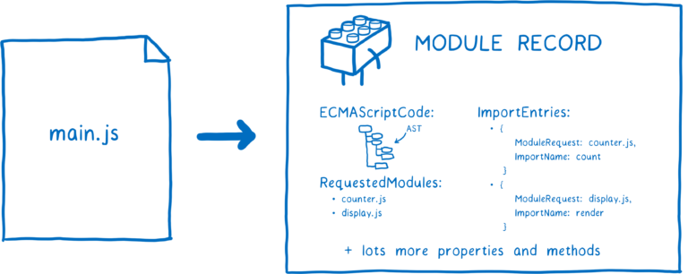

# 前端笔试面试题

[TOC]

## 请写出下列代码的打印顺序

```js {.font}
var name = "global";
var obj = {
  name: "local",
  foo: function () {
    this.name = "foo";
  }.bind(window),
};
var bar = new obj.foo();
setTimeout(function () {
  console.log(window.name);
}, 0);
console.log(bar.name);
var bar3 = (bar2 = bar);
bar2.name = "foo2";
console.log(bar3.name);
```

> 解析：
> 1、输出顺序主要考察：Event Loop；
> 2、第一个和第三个输出考察：this 指针；
> 3、第二个输出考察：引用类型赋值

```js {.font}
var name = "global";
var obj = {
  name: "local",
  foo: function () {
    console.log(this);
    this.name = "foo";
  }.bind(window),
};
console.log(obj.foo()); // 此时调用的this是window
// 由于new绑定的优先级大于bind绑定，所以函数内部this还是obj {}
var bar = new obj.foo();
console.log(bar); //{name：'foo'}
console.log(window.name); //global

// 定时器任务，在最后放入任务队列，window对象没有被改变，所以输出 'global'
setTimeout(function () {
  console.log(window.name);
}, 0);
// 此时bar.name =foo,因为被赋值了
console.log(bar.name);

// 此时执行顺序是var bar3,bar2=bar,bar3=bar2, 所以bar3/bar2/bar都是指向同一个对象
var bar3 = (bar2 = bar);
bar2.name = "foo2";
// 所以bar2修改属性，bar3的也改变了，此时输出为'foo2'
console.log(bar3.name);
```

## 请写出下面 ES6 代码编译后所生成的 ES5 代码

```js {.font}
class Person {
  constructor(name) {
    this.name = name;
  }
  greet() {
    console.log(`Hi, my name is ${this.name}`);
  }
  greetDelay(time) {
    setTimeout(() => {
      console.log(`Hi, my name is ${this.name}`);
    }, time);
  }
}
```

> > 解析：
> > 1、class 语法糖
> > 2、模板字符串
> > 3、setTimeout 中的 this 问题
> > 4、箭头函数中的 this 问题

```js {.font}
 fucntion Person(name){
     this.name=name;
 }
 Person.prototype.greet=function(){
    console.log('Hi, my name is'+this.name);
 }
 Person.prototype.greetDelay=function(time){
     var _this=this;
     setTimeout(
     fucntion(){
         console.log('Hi, my name is' _this.name);
     },time);
 }
```

## 排序算法

## JS 中创建节点的方式有哪些？

- Document.createElement()
- var dupNode = node.cloneNode(deep);
  > >
   <dl>
   <dt id="node"><code>node</code></dt>
   <dd>将要被克隆的节点</dd>
   <dt id="dupnode"><code>dupNode</code></dt>
   <dd>克隆生成的副本节点</dd>
   <dt id="deep"><code>deep</code> 可选</span></dt>
   <dd>是否采用深度克隆，如果为 <code>true</code>，则该节点的所有后代节点也都会被克隆，如果为 <code>false</code>，则只克隆该节点本身。</dd>
  </dl>

## redux 三大原则

<ul><li>
单一数据源
    <ul><li>整个应用程序的<span style='color:#fe2c24;'>state</span>只存储在<span style='color:#fe2c24;'>一个&nbsp;store</span>&nbsp;中</li><li>Redux并没有强制让我们不能创建多个Store，但是那样做并不利于数据的维护</li><li>单一的数据源可以让整个应用程序的state变得方便维护、追踪、修改</li></ul></li><li>
State是只读的
    <ul><li>唯一<span style='color:#fe2c24;'>修改State</span>的方法一定是<span style='color:#fe2c24;'>触发action</span>，不要试图在其他地方通过任何的方式来修改State</li><li>这样就确保了View或网络请求都不能直接修改state，它们只能通过action来描述自己想要如何修改stat；</li><li>这样可以保证所有的修改都被集中化处理，并且按照严格的顺序来执行，所以不需要担心race&nbsp;condition（竟态）的问题；</li></ul></li><li>
使用
<span style='color:#fe2c24;'>纯函数(返回结果只依赖于它的参数，并且在执行过程里面没有副作用)</span>来执行修改
    <ul><li>通过reducer将&nbsp;旧state和&nbsp;action联系在一起，并且返回一个新的State：</li><li>随着应用程序的复杂度增加，我们可以将reducer拆分成多个小的reducers，分别操作不同state&nbsp;tree的一部分</li><li>但是所有的reducer都应该是纯函数，不能产生任何的副作用</li></ul></li></ul>

## 下段代码打印结果为

```js {.font}
const Person = (name = "wang", age = 10) => {
  this.name = name;
  this.age = age;
  return this.name + " is " + this.age + "years old";
};
let result = new Person("zhang", 11);
console.log(result);
```

正解：**箭头函数不能作为构造函数使用**，所以函数执行会报错

## JavaScript 中，字符串与数组有许多相同的方法，以下不属于的是

- slice
- indexOf
- reverse
- concat

正解：字符串没有内置的 reverse 方法，可用`str.split("").reverse().join("")` 代替

## 以下哪些 ul 的 height 不是 0

```js {.font}
A：  <ul style="overflow: hidden;">
      <li style="float: left">1</li>
     </ul>

B：  <ul style="float: left;">
      <li style="float:left;">1</li>
     </ul>

C：  <ul style="clear: both;">
      <li style="float: left">1</li>
     </ul>
```

正解:AB

- A 选项：overflow：hidden 产生 BFC，可以防止元素塌陷
- B 选项： float：left 也产生 BFC，可以防止元素塌陷
- C 选项：clear：both，属性应该加载父级元素的最后一个子元素上，而不是加载父元素上

## 以下表达式，正确的是

正确答案: D 你的答案: B (错误)

A &nbsp;&nbsp;Number('a') == Number('a')
B &nbsp;&nbsp;-1 == true
C &nbsp;&nbsp;3 + '2' === 5
D &nbsp;&nbsp;![] == ''

js 在**转换布尔值**时候将：0、null、false、NaN、undefined、'' 转为 false，其他所有数据都转换为 true

注意：会将参数转换为布尔值的情况有：！、if()、A?B:C\*；**_在==类型转换时，并不会将数据转为布尔值_**

思考：

```js {.font}
判断：![]==[];
      null==false;
      undefined==false;
      []==false;
      NaN==false;
```

## 下列创建的对象中，打印的值分别为多少？

```js {.font}
var a = {},
  b = "123",
  c = 123;
a[b] = "b";
a[c] = "c";
console.log(a[b]); //==>c

var a = {},
  b = Symbol("123"),
  c = Symbol("123");
a[b] = "b";
a[c] = "c";
console.log(a[b]); //==>b

var a = {},
  b = { key: "123" },
  c = { key: "456" };
a[b] = "b";
a[c] = "c";
console.log(a[b]); //==>c
```

**属性访问器**提供了两种方式用于访问一个对象的属性，它们分别是**点号和方括号**，对象的**属性名**可以是任意的**字符串**或**Symbol**。其它类型会被\*\*自动转换成字符串

> > 转换为字符串规则：
> > 1、对象：**进行\[Symbol.toPrimitive]()\==>valuOf()\==>toString()**
> > 2、非对象：**String()**

1、(.) 点操作符: 静态的。右侧必须是一个以**属性名称命名的简单标识符**
2、([]) 中括号操作符: 动态的；方括号里必须是一个计算结果为字符串的表达式，可以是变量、字符串、数字、表达式(或 Symbol 值·了解)

## 关于 transition

正解：若**过渡起始值为 auto**，**不发生过渡效果**。所以要过渡某些属性，首先需要将其重置成具体数字值

## 关于\<input type="text" /> change 事件和 input 事件描述最准确的是？

正解：用户键入内容改变时，触发 input 事件，且在当标签失焦后，触发 change 事件

## CSS 中，top 属性是那两个部分的距离？

正解：top 样式属性定义了定位元素的**上外边距边界**与其包含块上边界(border-top)之间的偏移

## 5 % 6===5

## 通常情况下，一个 URL 的格式是

协议：//主机：端口/路径名称?搜索条件#哈希标识

## CSS 权重顺序正确的是

- 优先级
  > > !important>行内样式>ID 选择器>类选择器=伪类=属性>标签=伪元素>通配符(\* + > ~ )>继承>浏览器默认属性
  > > **_注意_**：**a:hover 为标签+伪类；input\[type='password']为标签+属性**
- 计算
  > > 具体到计算层面，优先级是由 ABCD 的值来决定的，计算规则如下：
  - A=是否存在内联样式？1：0
  - B=ID 选择器出现的次数
  - C=类选择器+属性选择器+伪类出现的总次数
  - D=标签选择器+伪元素出现的总次数
    **_注意：通配符选择器不影响优先级_**

## js 中,标识符不能以数字开头,必须是字母、下划线“\_”或美元符号“$”

## 怎样完美实现左右定宽，section 自适应尺寸的布局

```js {.font}
方式一: <div>
        <div class="right" />
        <div class="left" />
        <div class="section"/>
        </div>

     .content {
            height: 400px;
            background: #f90;
            width: 100%;
        }
        .left {
            width: 300px;
            height: 400px;
            background: purple;
            float: right;
        }
        .right {
            width: 300px;
            height: 400px;
            background: palevioletred;
            float: left;
        }


方式二:    <div style="display:flex">
            <div style="height: 100px;width: 100px;"></div>
            <div style="flex:1"> </div>
            <div style="height: 100px;width: 100px;"></div>
          </div>
```

## 执行下面的代码，执行后，5S 内点击两下，过了 5S 后，再点击两下，整个过程的输出结果是什么？

```js {.font}
setTimeout(function () {
  for (let i = 0; i < 1000; i++) {}
  console.log("timer a");
}, 0);

for (let j = 0; j < 5; j++) {
  console.log(j);
}

setTimeout(function () {
  console.log("timer b");
}, 0);

function waitFiveSeconds() {
  let now = new Date().getTime();
  while (new Date().getTime() - now < 5000) {}
  console.log("finished waiting");
}

document.addEventListener("click", function () {
  console.log("click");
});

console.log("click begin");
waitFiveSeconds();
```

## 写出下方代码打印顺序

```js {.font}
console.log("start");
setTimeout(() => console.log("s1"), 0);
new Promise((resolve) => {
  console.log("p1");
  resolve();
}).then((v) => {
  console.log("t1");
  setTimeout(() => {
    console.log("s2");
  }, 0);
  new Promise((resolve) => {
    console.log("p2");
    resolve();
  }).then((v) => {
    console.log("t2");
  });
  console.log("t3");
  setTimeout(() => {
    console.log("s3");
  }, 0);
});
console.log("end");
```

为什么学前端\*4

## 实现边长自适应的正方形

- 方法一,灵活运用视窗单位`vw`。当**没给 body 设置 css**时，**body 的 width 为 100vw，height 为 0**，即说明当一个元素以 body 为父元素时，**width：n%与 width：nvw 等价**，**height：n%与 height: nvh 等价且都等于 0**

```css
#square {
  width: 30vw;
  height: 30vw;
  background: red;
}
或者 #square {
  width: 30%;
  height: 30vw;
  background: red;
}
```

- 方法二，设置垂直方向的 padding 撑开容器。如果给子**元素的 padding 属性设置为 %**，无论上下左右方向，则其**基数都取决于父元素的 width 属性。**

```css
#square{
   width:30%;
   padding-bottom: 100%;  或者padding-top：30%
   background:red;
}
```

- 方法三，利用伪元素的 margin(padding)-top 撑开容器（::after 用来创建一个伪元素，作为已选中元素的最后一个**子元素**）

> > 为什么加`overflow：hidden`：在**垂直方向**上，当**子元素的 margin 与父元素的 border 相邻时**，**子元素的 margin 会贯穿父元素，变成父元素的 margin**==>margin 贯穿，是父元素形成一个 BFC 可避免这一现象，或者使用 padding 代替 margin

```css
#square{
    width:30%;
    background:red;
    overflow:hidden;
}
#square:after{
    content: '';
    display: block;
    margin-top:100%;  使用padding-top则不需要触发BFC
}
```

## v-if VS v-show

- v-if 是“真实的”按条件渲染，因为它确保了**在切换时，条件区块内的事件监听器和子组件都会被销毁与重建**

- v-if 也是惰性的：如果在初次渲染时条件值为 false，则不会做任何事。条件区块只有当条件首次变为 true 时才被渲染。

- 相比之下，**v-show 简单许多，元素无论初始条件如何，始终会被渲染，只有 CSS display 属性会被切换**。

- 总的来说，**v-if 有更高的切换开销**，而 v-show 有更高的初始渲染开销。**因此，如果需要频繁切换，则使用 v-show 较好**；如果在运行时绑定条件很少改变，则 v-if 会更合适

## \<style scoped>中的 scoped 的作用是？原理是？加和不加的区别

- 1、什么是 scoped，为什么要用？
  vue-cli 脚手架规范,**VUE 打包只生成一个 js 文件,一个 CSS 文件**
  当一个 style 标签拥有 scoped 属性时，它的 CSS 样式就只能作用于当前的组件，通过该属性，可以使得组件之间的样式不互相污染。

- 2、scoped 的原理（）
  ① 为组件实例生成一个唯一标识，给组件中的每个**标签对应的 dom 元素添加一个标签属性**，data-v-xxxx（也就是说：只要\<style scoped>定义的选择器选中了 DOM 元素，则该 DOM 元素有个标签属性 data-v-xxx，该组件的所有标签属性都一样，都为同一个 data-v-xxx）
  ② 给\<style scoped>中的每个选择器的最后一个选择器添加一个属性选择器，原选择器[data-v-xxxx]，如：原选择器为.container #id div，则更改后选择器为.container #id div[data-v-xxxx]

- 3、样式穿透

```HTML
<style scoped>
    div{
        color: red;
    }
    div h1 span{
      color:green !important;
    }
</style>

页面转换样式如下
<style>
    div[data-v-789]{
        color: red;
    }
    div h1 span[data-v-789]{
      color:green !important;
    }
</style>

DOM元素性质如下
<body>
  <div data-v-789>
    ddsfsf
        <h1 data-v-789>h111
            <span>
                span
            </span>
        </h1>
  </div>
```

问题出现：

> > &nbsp; div 为正在开发组件的元素（父元素），h1 为引入的外部组件（子元素），则在页面中最终会呈现如上代码一样的效果，即**只有子组件的根元素有跟父元素一样的属性标签**（即 scoped 只会作用至子组件根节点），但是**子组件的非根元素样式并没有属性标签**，div h1 span[data-v-789]选择器选择不到 span，若子组件有 css span{color:pink},最终 span 文字颜色为粉红色，若子组件无 css 样式，则 span 颜色为红色（继承父元素）

我们**如何在父组件中的 scope 里，修改子组件的 css 样式**？（既可以在该组件中生效，又不影响其他组件）

解决办法: 样式穿透 :deep()

```HTML
<style scoped>
    div{
        color: red;
    }
    :deep(div h1 span){
      color:green !important;
    }
</style>

页面转换样式如下:
<style>
    div[data-v-789]{
        color: red;
    }
    div[data-v-789] h1 span{
      color:green !important;
    }
</style>

DOM元素性质如下:
<body>
  <div data-v-789>
    ddsfsf
        <h1 data-v-789>h111
            <span>
                span
            </span>
        </h1>
  </div>
```

## js 与 ts 区别

## 前端框架里面的 key 的作用

- **相同的 key react 认为是同一个组件**，这样**后续相同的 key 对应组件都不会被创建**。在 render 函数执行的时候，**新旧两个虚拟 DOM 会进行对比**:
  **如果两个元素有不同的 key**，那么在前后两次渲染中就会被认为是不同的元素，这时候**旧的那个元素会被销毁，新的元素会被创建**
  **如果是相同的 key**，**且元素类型相同**， **若元素属性有所变化，则 React 只更新组件对应的属性，这种情况下，性能开销会相对较小。**

_问题：需要把 keys 设置为全局唯一吗？_
key 是用来进行 diff 算法的时候进行同层比较,**key 只需要在兄弟节点之间唯一**

## 跨域

## 事件委托

## 为什么要从 class 组件转向 function 组件（hooks 出现的意义）

<a href='https://zh-hans.reactjs.org/docs/hooks-intro.html'>官方解释：</a>
1、在组件之间<a href='https://blog.csdn.net/qq_39207948/article/details/113819803'>复用状态逻辑</a>很难
2、复杂组件变得难以理解（生命周期处理）

> > <a href='https://www.zhihu.com/question/343314784/answer/970219202'>函数式组件的心智模型更加“声明式”</a>，hooks（主要是 useEffect）取代了生命周期的概念（减少 API），让开发者的代码更加“声明化”：
> > 旧的思维：“我在这个生命周期要检查 props.A 和 state.B（props 和 state），如果改变的话就触发 xxx 副作用”。这种思维在后续修改逻辑的时候很容易漏掉检查项，造成 bug。
> > 新的思维：“我的组件有 xxx 这个副作用，这个副作用依赖的数据是 props.A 和 state.B”。从过去的命令式转变成了声明式编程。
> > 其实仔细想一想，人们过去使用生命周期不就是为了判断执行副作用的时机吗？现在 hooks 直接给你一个声明副作用的 API，使得生命周期变成了一个“底层概念”，无需开发者考虑。开发者工作在更高的抽象层次上了。
> > 类似的道理，除了声明副作用的 API，react 还提供了声明“密集计算”的 API（useMemo），取代了过去“在生命周期做 dirty 检查，将计算结果缓存在 state 里”的做法。React 内核帮你维护缓存，你只需要声明数据的计算逻辑以及数据的依赖。

3、难以理解的 class（学习成本+this）
4、Hook 避免了 class 需要的额外开支，像是创建类实例和在构造函数中绑定事件处理器的成本。

## 为什么要用虚拟 DOM

> > 虚拟 dom:就是一个普通的 js 对象

<a href='https://www.csdn.net/tags/NtTakgwsOTQxMDYtYmxvZwO0O0OO0O0O.html#DOM_47'>详解</a>
1、真实的 DOM 运行是很慢的，其元素非常庞大，页面的性能问题，大部分都是由 DOM 操作引起的，**真实的 DOM 节点，哪怕一个最简单的 div 也包含着很多属性，由此可见，操作真实 DOM 的代价仍旧是昂贵的**，频繁操作还是会出现页面卡顿，影响用户的体验

2、虚拟 dom 是相对于浏览器所渲染出来的真实 dom 而言的，在 react，vue 等技术出现之前，我们要改变页面展示的内容**只能通过遍历查询 dom 树的方式找到需要修改的 dom 然后修改样式行为或者结构**，来达到更新 ui 的目的，这种方式相当消耗计算资源，因为每次查询 dom 几乎都需要遍历整颗 dom 树，如果建立一个与 dom 树对应的虚拟 dom 对象（ js 对象），**以对象嵌套的方式来表示 dom 树及其层级结构，那么每次 dom 的更改就变成了对 js 对象的属性的增删改查，这样一来查找 js 对象的属性变化要比查询 dom 树的性能开销小**

3、通过 diff 算法对比新旧 vdom 之间的差异，可以批量的、最小化的执行 dom 操作，从而提高性能。

## 虚拟 DOM 是如何渲染到页面的

<a href="https://cn.vuejs.org/guide/extras/rendering-mechanism.html">Vue 的渲染机制</a>

## 箭头函数与普通函数的区别（见 js.md）

## 箭头函数中的 this 问题（见 js.md）

## 如何把 ts jsx vue 转换成浏览器能识别的语言

需要安装一些特殊的依赖库，需要把 typescript、jsx、vue 翻译成 JavaScript 语言浏览器才能运行出效果（如使用 Babel 将 jsx 编译成为浏览器支持的 JavaScript）

## 前端框架的 diffing 算法

<a href="https://zh-hans.reactjs.org/docs/reconciliation.html#the-diffing-algorithm">React diffing</a>

## 通常情况下，一个 URL 的格式是：协议：//主机：端口/路径名称?搜索条件#哈希标识

## 0.2 - 0.1 ==？0.1 、0.3 - 0.2 == ?0.1

## 已知字符串：'电话号码是：123-4567-8901'，如下正则表达式可以匹配到字符串中的电话号码的有

**_正确答案: B C D 你的答案: A C (错误)_**

- A: /\d[3]-\d[4]-\d[4]/
- B: /\d{3}-\d{4}-\d{4}/
- C: /[0-9-]+/
- D: /[0-9\\-]+/

> > 减号用在字符集“[…]”里表示一组字符，
> > 如：“[1-3]” —— 表示 1 到 5 中的任意一个字符，所以“H[1-3]”表示“H1”、“H2”或“H3”
> > 如果不是用在字符集“[…]”里，就是普通的字符，即减号：
> > “1-[1-3]” —— 表示“1-1”、“1-2”或者“1-3”
> > 但是，即使在字符集“[…]”里，却非连续字符之间，也失去了特殊含义：
> > “1[-1]” —— 表示“1-”或者“11”，此时使用转义符\也不会影响其原本的匹配

## 函数返回包含 n 个不重复的大于等于 2 小于 32 的随机数的数组

```js {.font}
function f(n) {
  let arr = new Array(n);
  let obj = {};
  for (let i = 0; i < n; i++) {
    arr[i] = Math.floor(Math.random() * 30) + 2;
    while (obj[arr[i]] !== undefined) {
      arr[i] = Math.floor(Math.random() * 30) + 2;
    }
    obj[arr[i]] = 1;
  }
  return arr;
}

function f(n) {
  let s = new Set();
  while (s.size !== n) {
    s.add(Math.floor(Math.random() * 30) + 2);
  }
  return [...s];
}

function f(n) {
  let arr = new Array(n);
  let obj = {};
  while (arr.length < n) {
    const temp = Math.floor(Math.random() * 30) + 2;
    if (obj[temp] == undefined) {
      arr.push(temp);
      obj[temp] = 1;
    }
  }
  return arr;
}
```

## promise 实现，红色三秒打印一次、绿色两秒打印一次、黄色一秒打印一次

```js
function red() {
  console.log("red");
}
function green() {
  console.log("green");
}
function yellow() {
  console.log("yellow");
}

function light(time, name) {
  return new Promise((resolve) => {
    setTimeout(() => {
      name();
      resolve();
    }, time);
  });
}

function step() {
  Promise.resolve()
    .then(() => {
      return light(3000, red);
    })
    .then(() => {
      return light(2000, green);
    })
    .then(() => {
      return light(1000, yellow);
    })
    .then(() => {
      // 黄色循环完毕再调用一次step，实现不断循环打印
      return step();
    });
}
step();
```

## 大文件上传

```js
// cutFile.ts
const CHUNK_SIZE = 1024 * 1024 * 10;
const THREAD_COUNT = navigator.hardwareConcurrency || 4;
export async function cutFile(file: File) {
  return new Promise((resolve) => {
    // 总共的分片数量
    const chunkCount = Math.ceil(file.size / CHUNK_SIZE);
    // 每个线程能分配到的分片数量
    const threadChunkCount = Math.ceil(chunkCount / THREAD_COUNT);
    const result: any[] = [];
    let finishCount = 0;
    for (let i = 0; i < THREAD_COUNT; i++) {
      // 开启一个线程任务
      const worker = new Worker(new URL("@/utils/worker.ts", import.meta.url), {
        type: "module",
      });
      let start = i * threadChunkCount;
      let end = Math.min(start + threadChunkCount, chunkCount);
      worker.postMessage({
        file,
        start,
        end,
        CHUNK_SIZE,
      });
      worker.onmessage = (e) => {
        worker.terminate();
        result[i] = e.data;
        finishCount++;
        if (finishCount === THREAD_COUNT) {
          resolve(result.flat());
        }
      };
    }
  });
}
```

```js
//worker.ts
import SparkMD5 from "spark-md5";
function createChunk(file: File, index: number, chunkSize: number) {
  return new Promise((resolve) => {
    const start = index * chunkSize;
    const end = start + chunkSize;
    const spark = new SparkMD5.ArrayBuffer();
    const fileReader = new FileReader();
    const blob = file.slice(start, end);
    fileReader.onload = (e: any) => {
      spark.append(e.target.result);
      resolve({
        start,
        end,
        index,
        hash: spark.end(),
        blob,
      });
    };
    fileReader.readAsArrayBuffer(blob);
  });
}

onmessage = async (event) => {
  const { file, start, end, CHUNK_SIZE } = event.data;
  const result = [];
  for (let i = start; i < end; i++) {
    const promise = createChunk(file, i, CHUNK_SIZE);
    result.push(promise);
  }
  const chunks = await Promise.all(result);
  postMessage(chunks);
};
```

## 断点续传

- `localStorage`保存

```js
{
  key:`${file.name}-${file.size}-${file.lastModified}`,
  value:[1,2,3,...]; //已上传的块index
}
```

- `indexedDB`保存
  切完后，将 blob,存储到 IndexedDB,下次用户进来之后，嗅探一下是否存在未完成上传的切片，有就尝试继续上传

## 秒传

用户上传的文件在服务端已经存在时，直接返回成功。通常通过文件哈希来判断文件是否已经上传。

## ES 模块是如何工作的

1. 构建过程（Construction） -- 查找并解析所有的模块文件，生成模块记录。
   模块记录包括以下信息：

   - 导入的模块（imports）
   - 导出的内容（exports）：
   - 求值状态（evaluationStatus）：模块是否已被过。
     

2. 初始化（Instantiation） -- 为模块导出的变量分配内存（但不求值）。然后将导入和导出都指向这些内存地址，这称为链接。

3. 求值（Evaluation） -- 运行代码，将变量值填充到内存中去。

## Vite (bundleless)

### 原理

在`<script type="module">`中，浏览器遇到内部的 import 引用时，会自动发起 http 请求，去加载对应的模块。
vite 也正是利用了 ES module 这个特性，使用 vite 运行项目时，首先会用 esbuild 进行预构建，将所有模块转换为 es module，不需要对我们整个项目进行编译打包，而是在浏览器需要加载某个模块时，拦截浏览器发出的请求，根据请求进行按需编译，然后返回给浏览器。
这样一来，首次启动项目（冷启动）时，自然也就比 webpack 快很多了，并且项目大小对 vite 启动速度的影响也很小。

1. 解决了服务器启动缓慢的问题

   - 使用 esbuild 预构建依赖

     > 当你首次启动 vite 时，Vite 在本地加载你的站点之前预构建了项目依赖。默认情况下，它是自动且透明地完成的，目的是：
     >
     > - 性能： 为了提高后续页面的加载性能，Vite 将那些具有许多内部模块的 ESM 依赖项转换为单个模块。
     > - CommonJS 和 UMD 兼容性

   - 以原生 ESM 方式提供源码，在浏览器请求源码时进行转换并按需提供源码(通过 esbuild)

2. 解决了更新缓慢的问题
   在 Vite 中，HMR 是在原生 ESM 上执行的。当编辑一个文件时，Vite 只需要精确地使已编辑的模块与其最近的 HMR 边界之间的链失活（大多数时候只是模块本身），使得无论应用大小如何，HMR 始终能保持快速更新。
   > - Vite 的 HMR 以 模块为单位 进行更新
   > - Vite 通过显式 HMR 边界限制更新范围
   >   示例：
   >   假设依赖链为 App → Router → Page → Component，若修改 Component，Vite 仅使 Component → Page 的链路失效（若 Page 是 HMR 边界），而 App 和 Router 不受影响。

### 架构

入口 entry：`/src/main.ts`


## Webpack

Webpack 是一个模块打包工具，主要用于将项目中的各种资源（JavaScript、CSS、图片、字体等）作为模块进行组织、编译、转换和打包，从而生成浏览器可以高效加载的静态资源文件。它的核心目标是把应用程序的所有依赖（包括代码和静态资源）打包成一个或多个 bundle，从而提高加载效率、减少请求数并支持代码拆分、懒加载等高级特性。

---

### Webpack 的底层运作流程

Webpack 的运作可以大致分为以下几个阶段：

1. **初始化与配置加载**

   - **读取配置**：Webpack 首先读取配置文件（如 webpack.config.js），获取入口文件（entry）、输出配置（output）、加载器（loaders）、插件（plugins）等信息。
   - **设置环境**：根据配置初始化内部状态，决定构建环境（开发环境、生产环境）和优化策略。

2. **构建依赖图（Module Graph）**

   - **入口解析**：从入口文件开始，Webpack 分析文件中的依赖关系。它会扫描代码中通过 import/require 引入的模块。
   - **模块解析**：每个被引用的模块都会被解析。Webpack 根据配置调用相应的 Loader（例如 Babel Loader、CSS Loader）来转换代码或资源。
   - **递归查找依赖**：对每个模块继续扫描，构建出一个完整的依赖图，涵盖所有直接或间接依赖的模块。

3. **转换与编译模块**

   - **Loader 执行**：每个模块在打包前会经过配置的 Loader 处理，这个过程包括转译（例如 ES6 转换为 ES5）、预处理（如 Sass 编译）、资源处理（如图片转换为 Base64）等。
   - **模块转换**：转换后的模块以统一格式表示（通常是 JavaScript 模块），并被标记为可供打包。

4. **生成 Chunk 与 Bundle**

   - **代码拆分**：Webpack 根据配置（如动态导入、SplitChunksPlugin）将依赖图拆分成多个 chunk，这有助于实现按需加载和优化缓存。
   - **打包输出**：Webpack 将各个 chunk 合并成一个或多个 bundle，生成最终的静态文件（通常是 JavaScript 文件），同时也生成 source map、CSS 文件和其他资源文件。

5. **插件机制**

   - **插件执行**：在整个构建过程中，Webpack 的插件系统会拦截和处理各种钩子（hook），实现诸如优化、压缩、热更新、环境变量注入等功能。插件能够深度参与构建流程，改变或扩展 Webpack 的行为。

6. **输出与部署**
   - **文件输出**：Webpack 根据 output 配置，将所有 bundle 写入指定的输出目录。
   - **部署准备**：生成的文件可以直接部署到服务器，或者进一步经过 CDN 分发、缓存优化等步骤。

---

#### 简单示例

假设有如下简单配置：

```js
// webpack.config.js
const path = require("path");

module.exports = {
  entry: "./src/index.js", // 入口文件
  output: {
    filename: "bundle.js", // 打包后的文件名
    path: path.resolve(__dirname, "dist"), // 输出目录
  },
  module: {
    rules: [
      {
        test: /\.js$/, // 针对 .js 文件使用 Babel 转换
        exclude: /node_modules/,
        use: "babel-loader",
      },
      {
        test: /\.css$/, // 针对 .css 文件使用 CSS Loader 和 style-loader
        use: ["style-loader", "css-loader"],
      },
    ],
  },
  plugins: [
    new HtmlWebpackPlugin({
      template: "./src/index.html",
    }),
    new MiniCssExtractPlugin({
      filename: "[name].[contenthash].css",
    }),
  ],
};
```

在这种配置下，Webpack 会：

- 从 `./src/index.js` 开始扫描依赖，
- 对所有 .js 文件使用 Babel Loader 进行转换，
- 对 .css 文件使用 CSS Loader 转换后，通过 style-loader 注入到页面中，
- 将所有处理后的模块打包成 `dist/bundle.js` 文件。

---

#### 总结

- **Webpack 是一个强大的模块打包器**，它将所有资源视为模块，通过 Loader 和插件系统处理和转换，然后将它们合并成最终的静态文件。
- **其底层流程** 包括配置读取、依赖图构建、模块转换、chunk 和 bundle 生成以及插件介入各个构建环节。
- 这种模块化的打包方式使得前端开发能够更高效地管理依赖、优化性能并实现代码拆分和懒加载等高级特性。
  

### webpack 的配置有哪些？

- **entry**: 入口文件地址。可以是单个，可以是多个。
- **output**: 输出的内容，path,filename,publicPath
- **module**: loaders, 将文件内容转换进行转译、编译
- **plugin**: 对打包流程的干预和增加,通过 Webpack 提供的生命周期钩子，添加自定义逻辑（如优化、资源管理）。
- **resolve**:
  - 路径别名(`resolve{alias:{'@': **}}`)
  - 扩展名 `extensions:['.ts', '.tsx', '.vue']`;导入的时候省略文件后缀
  - 主文件名：`mainFiles: ['index', 'main']`,指定目录下的默认入口文件名
  - 模块搜索目录：`modules: [ 'node_modules']`
- **externals**: 不需要打包的 module
- **devServer**: port
- **optimization**: chunk, cacheGroup

### loader 与 plugin 的区别

- loader 更专注于文件的转换，**是转换器**，让 webpack 处理非 JS 模块，一般在固定的流程（打包文件之前）起作
  用
- p1ugin 更专注于流程的扩展，**是扩展器**。让输出资源的能力更丰富，在整个生命周期里，都起作用

### webpack 指纹占位符

- ext: 资源的后缀名
- name: 文件的名字
- path: 文件的相对路径
- folder: 文件所在文件夹
- hash: 每次构建的时候，任何一点改动，整个项目的 hash 都会变
- chunkhash: 只在当前 chunk 有改动的时候，hash 会变
- contenthash: 根据文件的内容，决定是否改变

### 怎么理解 chunk 与 bundle

Module（源码） → Webpack 处理 → Chunk（中间代码块） → 优化打包 → Bundle（最终文件）

- chunk: 构建流程的产物
- bundle: 最终的产物

### webpack 的 tree shaking 的原理

- `usedExports`: 会有一些导入但未使用
- `sideEffects`: 导出了但未使用；
- `dead code elimination`: 最终在产物里，删除一些死代码。`if(true)`

### 如何减小 webpack 打包后的体积/性能优化

- code spliting 非首屏加载的数据，先排除掉。
- tree shaking
- 压缩
- 按需引入
- CDN 加速

## <a href="https://juejin.cn/post/7283682738497765413?searchId=20250228175028AB78D75C81CADE4E2D7C">Webpack VS Vite</a>

## 模块联邦 ​

模块联邦（Module Federation）是 Webpack 5 引入的一项重要特性，旨在解决微前端架构下的代码共享和依赖管理问题。它允许多个独立的前端应用在运行时动态加载和共享模块。​
​

### 特征：​

1. 动态加载：模块联邦支持在运行时动态加载远程模块，而不是在编译时将所有代码打包在一起。​
2. 代码共享：不同应用之间可以共享模块，无需重复打包，提高了代码复用性和加载速度。​
3. 独立部署：各个应用可以独立开发、测试和部署，互不影响。​
4. 自动依赖处理：模块联邦自动处理依赖关系，确保加载的模块能够正常运行。​
   ​

### 优点：​

1. 提高开发效率：不同团队可以独立开发和部署各自的模块或应用，减少了开发依赖，提高了开发效率。​
2. 代码复用：通过模块联邦，多个应用可以共享相同的代码或组件，减少了重复代码，降低了维护成本。​
3. 性能优化：动态加载减少了初始加载时间，只在需要时加载特定模块，提高了应用的性能。​
4. 独立部署：各个应用或模块可以独立部署和更新，降低了集成和发布的复杂性。​
5. 技术栈独立：不同的子应用可以使用不同的技术栈，满足各团队的技术需求。​
   ​

### 缺点：​

1. 复杂性增加：模块联邦引入了更多的配置和管理复杂性，需要开发者具备一定的知识和经验。​
2. 版本管理：在共享模块时，必须小心处理版本兼容性问题，确保不同版本的模块能够正常工作。​
3. 性能开销：动态加载远程模块可能引入一定的网络延迟和性能开销，特别是在低带宽或高延迟环境下。​
4. 构建和部署协调：需要良好的构建和部署策略，确保各个模块或应用在发布时能够正确加载和运行。​

### 示例 ​

应用 A (Host) 配置 ​

```js
// webpack.config.js (App A)​
const path = require('path');​
const { ModuleFederationPlugin } = require('webpack').container;​
​
module.exports = {​
  entry: './src/index.js',​
  mode: 'development',​
  devServer: {​
    contentBase: path.join(__dirname, 'dist'),​
    port: 3001,​
  },​
  output: {​
    publicPath: 'http://localhost:3001/',​
  },​
  plugins: [​
    new ModuleFederationPlugin({​
      name: 'appA',​
      remotes: {​
        appB: 'appB@http://localhost:3002/remoteEntry.js',​
      },​
    }),​
  ],​
};
```

应用 B (Remote) 配置 ​

```JS
// webpack.config.js (App B)​
const path = require('path');​
const { ModuleFederationPlugin } = require('webpack').container;​
​
module.exports = {​
  entry: './src/index.js',​
  mode: 'development',​
  devServer: {​
    contentBase: path.join(__dirname, 'dist'),​
    port: 3002,​
  },​
  output: {​
    publicPath: 'http://localhost:3002/',​
  },​
  plugins: [​
    new ModuleFederationPlugin({​
      name: 'appB',​
      filename: 'remoteEntry.js',​
      exposes: {​
        './Module': './src/Module',​
      },​
    }),​
  ],​
};
```

​
​
应用 B 中的模块 ​

```JS
// src/Module.js (App B)​
export const greet = () => 'Hello from App B';​
```

​

应用 A 中使用远程模块 ​

```JS
// src/index.js (App A)​
import('appB/Module').then(module => {​
console.log(module.greet());​
});​​
```

## MFSU

MFSU 是一种基于 webpack5 新特性 Module Federation 的打包提速方案。其核心的思路是通过分而治之，将应用源代码的编译和应用依赖的编译分离，将变动较小的应用依赖构建为一个 Module Federation 的 remote 应用，以免去应用热更新时对依赖的编译。

开启 MFSU 可以大幅减少热更新所需的时间了

MFSU 做的事情其实就是扫描依赖，**对依赖预打包**，然后通过 Module Federation 共享给业务工程消费。业务工程无需对依赖进行构建、打包，进而提升了构建效率。有没有觉得这种设计思路很熟悉了，没错，Vite 也用到了依赖预构建。

## 微前端

将单体前端应用拆分为多个独立的前端模块，这些模块可以由不同的团队使用不同的**技术栈独立**开发、测试和部署，最终集成在一起，形成一个完整的前端应用。


## 低代码平台

前端低代码是一种利用可视化工具和预构建组件来开发前端应用的方式，旨在减少手写代码量，让开发人员或业务人员可以更快速地构建和部署用户界面。
（百度的低代码平台直接用 JSON 来配置）

## NextJS 与 SSR

Next.js 的渲染原理是其核心优势之一，它结合了多种渲染策略（如 **SSG、SSR、CSR、ISR**）和现代前端架构，提供灵活且高性能的渲染方案。以下是 Next.js 渲染原理的全面解析：

---

### 一、Next.js 的渲染模式

Next.js 支持多种渲染模式，开发者可以根据页面需求灵活选择：

| 模式                                       | 特点                                        | 适用场景                                 |
| ------------------------------------------ | ------------------------------------------- | ---------------------------------------- |
| **SSG（Static Site Generation）**          | 构建时生成静态 HTML，**无需服务端实时计算** | 博客、文档站、营销页等完全静态内容       |
| **SSR（Server-Side Rendering）**           | 每次请求时生成 HTML，**实时动态内容**       | 用户仪表盘、个性化页面、SEO 敏感的动态页 |
| **CSR（Client-Side Rendering）**           | 浏览器中通过 JavaScript 渲染内容            | 交互复杂的 SPA（如管理后台）             |
| **ISR（Incremental Static Regeneration）** | SSG + 按需更新，**增量再生静态页面**        | 大规模动态内容（如电商商品页）           |
| **混合渲染（Hybrid Rendering）**           | 同一应用内混合使用多种模式                  | 大多数现代 Web 应用                      |

---

### 二、核心渲染流程

#### 1. **构建阶段（Build Time）**

- **SSG 页面生成**：通过 `getStaticProps` 或 App Router 的 `generateStaticParams` 生成静态 HTML。
- **代码优化**：自动代码分割（Code Splitting）、预取（Prefetching）、优化 Bundle。

#### 2. **请求处理阶段（Runtime）**

- **路由匹配**：根据请求路径匹配页面组件。
- **渲染策略决策**：
  - **静态页面**（SSG/ISR）：直接返回预生成的 HTML。
  - **动态页面**（SSR）：调用 `getServerSideProps` 或 App Router 的 Server Component 获取数据并生成 HTML。
- **流式传输（Streaming）**：通过 Suspense 分块传输 HTML，提升首屏速度（App Router 特性）。

#### 3. **客户端 Hydration**

- **交互增强**：静态或服务端渲染的 HTML 在浏览器中通过 React Hydration 变为可交互的 SPA。
- **客户端导航**：通过 `next/link` 或 `next/router` 实现无刷新页面切换（类似 SPA）。

---

### 三、关键机制详解

#### 1. **数据获取与渲染策略**

| 方法                                | 执行时机            | 用途                       |
| ----------------------------------- | ------------------- | -------------------------- |
| `getStaticProps` (Pages Router)     | 构建时或 ISR 再生时 | 为 SSG/ISR 页面提供数据    |
| `getServerSideProps` (Pages Router) | 每次请求时          | 为 SSR 页面提供实时数据    |
| **Server Components** (App Router)  | 每次请求时（默认）  | 直接在服务端获取数据并渲染 |
| `use client` + `useEffect`          | 客户端运行时        | 处理客户端交互或动态数据   |

```jsx
// App Router 示例：混合服务端与客户端组件
// app/page.js (Server Component)
async function Page() {
  const data = await fetchData(); // 服务端直接获取数据
  return (
    <div>
      <StaticContent data={data} />
      <ClientComponent /> {/* 客户端交互 */}
    </div>
  );
}

// app/ClientComponent.js
'use client';
function ClientComponent() {
  const [state, setState] = useState();
  return <button onClick={() => setState(...)}>Click</button>;
}
```

#### 2. **缓存与增量更新（ISR）**

- **`revalidate` 参数**：控制页面再生间隔（如 `revalidate: 60` 表示 60 秒后过期）。
- **按需再生**：通过 `res.revalidate()` 或 Webhook 手动触发更新。
- **CDN 集成**：结合 CDN 边缘缓存实现全局快速更新。

#### 3. **流式渲染（Streaming）**

- **分块传输**：将页面拆分为多个模块，优先传输关键内容。
- **Suspense 支持**：延迟加载非关键部分，提升首屏速度。

```jsx
// App Router 流式渲染示例
async function Page() {
  return (
    <div>
      <Header />
      <Suspense fallback={<Loading />}>
        <SlowComponent /> {/* 异步加载 */}
      </Suspense>
    </div>
  );
}
```

---

### 四、不同路由模式的差异

#### 1. **Pages Router（传统模式）**

- 基于文件系统的路由（`pages/` 目录）。
- 通过 `getStaticProps`/`getServerSideProps` 明确区分渲染策略。
- 客户端导航依赖 `next/router`。

#### 2. **App Router（新架构，推荐）**

- 基于 `app/` 目录的路由系统。
- **服务端组件默认启用**，通过 `'use client'` 标记客户端组件。
- **嵌套布局（Layouts）**：共享 UI 且保留状态。
- **React Server Components (RSC)**：直接在服务端渲染组件树。

---

### 五、性能优化机制

1. **自动静态优化**
   - 未使用 `getServerSideProps` 的页面自动转为 SSG。
2. **增量静态再生（ISR）**
   - 仅更新过期页面，无需全量构建。
3. **客户端代码按需加载**

   - 通过动态导入（`dynamic import`）延迟加载非关键组件。

   ```jsx
   const HeavyComponent = dynamic(() => import("./HeavyComponent"), {
     loading: () => <Skeleton />,
   });
   ```

4. **图片优化**
   - 自动转换 WebP 格式、Lazy Loading、尺寸优化（通过 `next/image`）。

---

### 六、不同场景的渲染策略选择

| 场景               | 推荐策略                     | 原因                  |
| ------------------ | ---------------------------- | --------------------- |
| **内容为主的网站** | SSG + ISR                    | 高性能且支持内容更新  |
| **用户个性化页面** | SSR + CSR                    | 实时数据 + 客户端交互 |
| **大型电商网站**   | ISR + On-Demand Revalidation | 平衡性能与动态性      |
| **管理后台**       | CSR                          | 交互复杂，SEO 无关    |

---

### 七、总结

Next.js 的渲染原理通过以下核心设计实现高性能与灵活性：

1. **混合渲染架构**：自由组合 SSG、SSR、CSR、ISR。
2. **服务端与客户端组件的协作**：App Router 实现更细粒度的控制。
3. **智能缓存与再生**：ISR 解决传统 SSG 的更新痛点。
4. **流式传输与代码分割**：优化加载性能。

开发者应根据具体需求（如 SEO、实时性、交互复杂度）选择合适的渲染策略，充分发挥 Next.js 的渲染能力。

## 浏览器渲染


