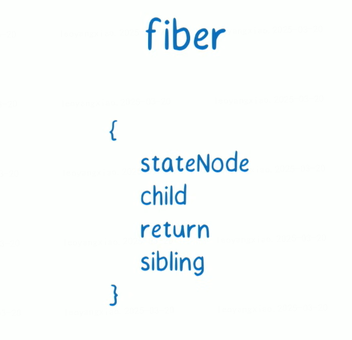
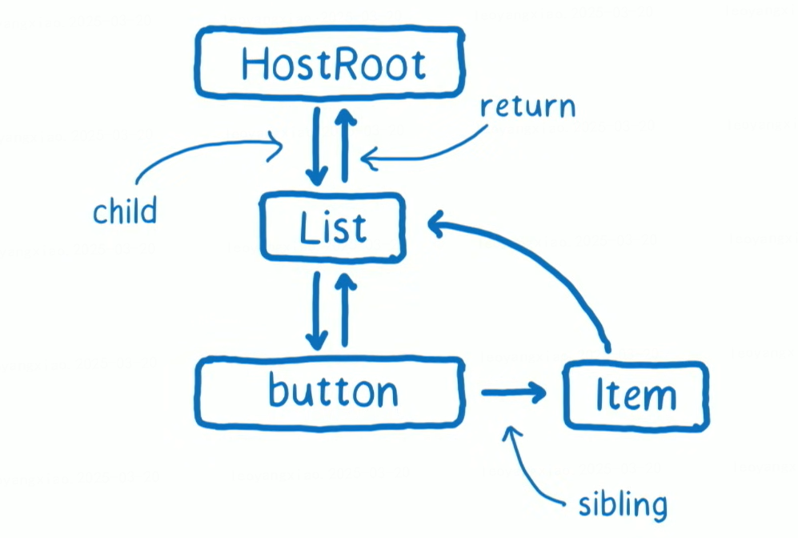
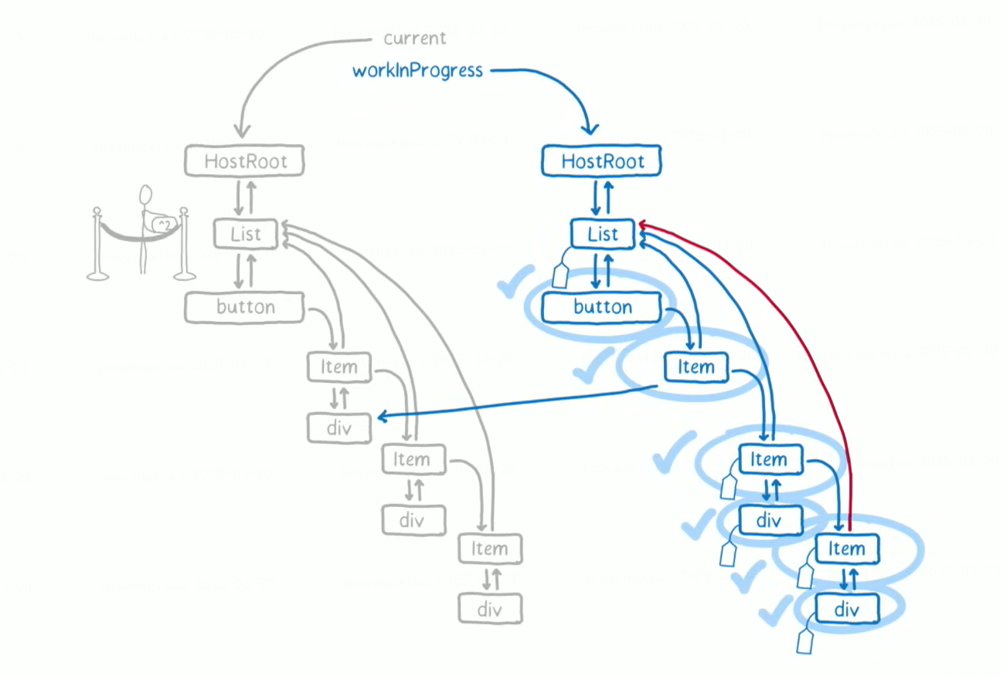
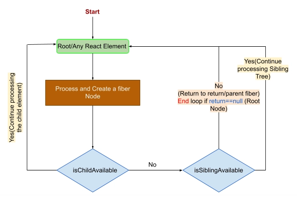

# react 笔记

## 为什么要从 class 组件转向 function 组件（hooks 出现的意义）

<a href='https://zh-hans.reactjs.org/docs/hooks-intro.html'>官方解释：</a>
1、在组件之间<a href='https://blog.csdn.net/qq_39207948/article/details/113819803'>复用状态逻辑</a>很难
2、复杂组件变得难以理解（生命周期处理）

> <a href='https://www.zhihu.com/question/343314784/answer/970219202'>函数式组件的心智模型更加“声明式”</a>，hooks（主要是 useEffect）取代了生命周期的概念（减少 API），让开发者的代码更加“声明化”：
> 旧的思维：“我在这个生命周期要检查 props.A 和 state.B（props 和 state），如果改变的话就触发 xxx 副作用”。这种思维在后续修改逻辑的时候很容易漏掉检查项，造成 bug。
> 新的思维：“我的组件有 xxx 这个副作用，这个副作用依赖的数据是 props.A 和 state.B”。从过去的命令式转变成了声明式编程。
> 其实仔细想一想，人们过去使用生命周期不就是为了判断执行副作用的时机吗？现在 hooks 直接给你一个声明副作用的 API，使得生命周期变成了一个“底层概念”，无需开发者考虑。开发者工作在更高的抽象层次上了。
> 类似的道理，除了声明副作用的 API，react 还提供了声明“密集计算”的 API（useMemo），取代了过去“在生命周期做 dirty 检查，将计算结果缓存在 state 里”的做法。React 内核帮你维护缓存，你只需要声明数据的计算逻辑以及数据的依赖。

3、难以理解的 class（学习成本+this）
4、Hook 避免了 class 需要的额外开支，像是创建类实例和在构造函数中绑定事件处理器的成本。

## 为什么要用虚拟 DOM

📌 虚拟 dom:就是一个普通的 js 对象

<a href='https://www.csdn.net/tags/NtTakgwsOTQxMDYtYmxvZwO0O0OO0O0O.html#DOM_47'>详解</a>
1、真实的 DOM 运行是很慢的，其元素非常庞大，页面的性能问题，大部分都是由 DOM 操作引起的，**真实的 DOM 节点，哪怕一个最简单的 div 也包含着很多属性，由此可见，操作真实 DOM 的代价仍旧是昂贵的**，频繁操作还是会出现页面卡顿，影响用户的体验

2、虚拟 dom 是相对于浏览器所渲染出来的真实 dom 而言的，在 react，vue 等技术出现之前，我们要改变页面展示的内容**只能通过遍历查询 dom 树的方式找到需要修改的 dom 然后修改样式行为或者结构**，来达到更新 ui 的目的，这种方式相当消耗计算资源，因为每次查询 dom 几乎都需要遍历整颗 dom 树，如果建立一个与 dom 树对应的虚拟 dom 对象（ js 对象），**以对象嵌套的方式来表示 dom 树及其层级结构，那么每次 dom 的更改就变成了对 js 对象的属性的增删改查，这样一来查找 js 对象的属性变化要比查询 dom 树的性能开销小**

3、通过 diff 算法对比新旧 vdom 之间的差异，可以批量的、最小化的执行 dom 操作，从而提高性能

## Fiber reconcile

- Fiber 实质是一个普通的 JavaScript 对象，它与实例具有一对一关系，所有 Fiber 节点共同组成一个 Fiber 链表树（有链接属性，同时又有树的结构），这种结构让 React 可以细粒度控制节点的行为。
- Reconcile(协调器)是一种算法，它帮助 React 比较两个 DOM 树，以确定需要做出的更改。
  
  
  
  

- React 渲染两个核心阶段

  1. 协调(Reconciliation)阶段
     react 可以中断与恢复，利用的就是 Fiber 的数据结构特性与`requestIdleCallback`,
     **双缓冲技术：** React 在更新时，会根据现有的 Fiber 树（Current Tree）创建一个新的临时树（Work-in-progress (WIP) Tree）,WIP-Tree 更新完成后会复制其它节点，并最终替换掉 Current Tree，成为新的 Current Tree。因为 React 在更新时总是维护了两个 Fiber 树，所以可以随时进行比较、中断或恢复等操作，而且这种机制让 React 能够同时具备拥有优秀的渲染性能和 UI 的稳定性

  2. 提交阶段（Commit）：
     将协调阶段生成的更新计划（副作用链表）同步应用到真实 DOM。这是不可中断的同步阶段，必须一次性完成。

- 优先级：低优先级渲染任务可以被高优先级任务中断，高优先级任务会生成一个**新的 workInProgress tree**，快速完成渲染并提交到屏幕，然后恢复低优先级任务。

## useMemo, useCallback, React.Memo

- `useMemo(fn,[dep])`,保存函数 fn 返回值，当依赖项 dep 改变时，重新执行 fn，更新保存的返回值

- `useCallback(fn,[dep])`,保存函数 fn 的引用，当依赖项 dep 改变时，重新创建 fn 函数

- `useCallback === useMemo(()=>fn,[dep])
`

- `React.memo(fn)` :父组件更新了，但是`React.memo`包装子组件的 props 没变，那么该子组件就跳过重新渲染

## Suspense 允许在子组件完成加载前展示后备方案

只有启用了 Suspense 的数据源才会激活 Suspense 组件，它们包括：

- 支持 Suspense 的框架如 Relay 和 Next.js。
- 使用 lazy 懒加载组件代码。
- 使用 use 读取 Promise 的值。

## react 中的 hook 为什么只能放在组件顶层？

React 使用**链表结构**来跟踪和管理组件内的**所有 Hook**。每次渲染时，React 会严格按 Hook 1 → Hook 2 → Hook 3 的**顺序**读取状态。如果顺序变化（如因条件语句或循环导致），React 将无法正确匹配状态，引发逻辑错误。

```JS
const [a, setA] = useState(1);  // Hook 1
if (condition) {
  const [b, setB] = useState(2); // Hook 2
}
const [c, setC] = useState(3);   // Hook 3
// 假设第一次渲染时条件为真，调用顺序为Hook1 →  Hook2
// 第二次渲染时，若 condition 变为假，调用顺序变为 Hook 1 → Hook 3。
// 此时 React 会误认为：Hook 3 对应第一次渲染的 Hook 2 的状态，导致数据错乱。
```

通过这种机制，React 保证了函数组件状态的**可预测性和稳定性**，避免了因代码结构变化引发的隐蔽错误。

## useTransition

useTransition 是一个帮助你在不阻塞 UI 的情况下更新状态的 React Hook。

React 会利用 Fiber 架构将 useTransition 标记的更新设为低优先级任务，并在后台分片执行。
