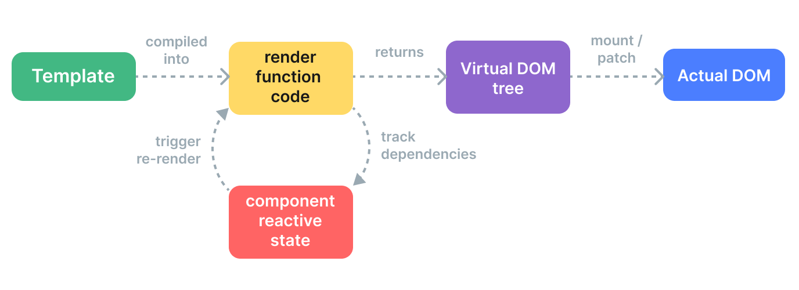

# Vue 笔记

[TOC]

## Vue 响应式原理

| 实现原理 | `defineProperty`                               | `Proxy`                                     | `getter` `setter`   |
| -------- | ---------------------------------------------- | ------------------------------------------- | ------------------- |
| 实际场景 | Vue 2 响应式                                   | Vue 3 `reactive`                            | Vue 3 `ref`         |
| 优势     | 兼容性                                         | 基于 Proxy 实现真正的拦截，自动代理嵌套对象 | 实现简单            |
| 劣势     | 数组和属性删除等监听不了，深度嵌套对象需要递归 | 兼容不了 IE11                               | 只拦截了 value 属性 |
| 实际应用 | Vue 2                                          | Vue 3 复杂数据结构                          | Vue 3 简单数据结构  |

### Vue2 defineProperty

```JS
const getDouble = (n) => n*2
const obj = {}
let count = 1
let double = getDouble(count)

Object.defineProperty(obj,'count',{
    get(){
        return count
    },
    set(val){
        count = val
        double = getDouble(val)
    }
})
console.log(double)  // 打印2
obj.count = 2
console.log(double) // 打印4  有种自动变化的感觉
```

```JS
delete obj.count
console.log(double) // doube还是4
```

## 深入响应式原理

### 目标

```js
// 当 A0，A1改变时，A2也需同步更新
A0 = 1;
A1 = 2;
A2 = A0 + A1;
```

为了能重新运行计算的代码来更新 A2，我们需要将其包装为一个函数：

```js
function update() {
  A2 = A0 + A1;
}
```

### 定义术语

1. **副作用**：因为 `update` 会更改程序里面的 `A2` 的状态，我们称之函数会产生一个副作用，简称作用(effect)
2. **依赖**：因为执行 `update` 需要依赖`A0`,`A1`，所以 `A0` 和 `A1` 被视为这个作用的依赖 (dependency)
3. **订阅者**：作用也可以被称作它的依赖的一个订阅者

### 实现

```js
function reactive(obj) {
  return new Proxy(obj, {
    get(target, key) {
      track(target, key);
      return target[key];
    },
    set(target, key, value) {
      target[key] = value;
      trigger(target, key);
    },
  });
}

function ref(value) {
  const refObject = {
    get value() {
      track(refObject, "value");
      return value;
    },
    set value(newValue) {
      value = newValue;
      trigger(refObject, "value");
    },
  };
  return refObject;
}
```

可以看到 vue3 在创建响应式对象的时候，分别在 `get` 阶段进行依赖收集 track、在 `set` 阶段执行副作用 trigger

#### track()

在 `track() `内部，我们会检查当前是否有正在运行的副作用。如果有，我们会查找到一个存储了所有追踪了该属性的订阅者的 `Set`，然后将当前这个副作用作为新订阅者添加到该 `Set` 中。

```js
// 这会在一个副作用就要运行之前被设置
// 我们会在后面处理它
let activeEffect;

function track(target, key) {
  if (activeEffect) {
    const effects = getSubscribersForProperty(target, key);
    effects.add(activeEffect);
  }
}
```

副作用订阅将被存储在一个全局的 `WeakMap<target, Map<key, Set<effect>>>` 数据结构中

#### trigger

在 `trigger()`之中，我们会再查找到该属性的所有订阅副作用。但这一次我们需要执行它们：

```js
function trigger(target, key) {
  const effects = getSubscribersForProperty(target, key);
  effects.forEach((effect) => effect());
}
```

#### whenDepsChange(updateFn) 函数 也可以视为 watchEffect(updateFn),computed(updateFn)

```js
function whenDepsChange(update) {
  const effect = () => {
    activeEffect = effect;
    update();
    activeEffect = null;
  };
  effect();
}
```

当`whenDepsChange`首次执行时，`update`函数语句`A2 = A0 + A1;`
读取`A0`与`A1`时，触发了 `track`，收集了依赖，给 A2 赋值的时候触发了`trigger`,后续修改`A0`与`A1`时，A2 便会自动更新。

#### 为什么是 WeakMap

使用 WeakMap，当目标对象（例如某个 reactive 对象）在其它地方不再被引用时，它在 WeakMap 中的对应映射也会自动失效，从而避免内存泄漏。

> 内存泄漏是指程序中已经不再使用的数据或对象没有被释放，导致这些内存空间无法被回收利用，从而在程序运行过程中逐渐占用越来越多的内存资源。长时间运行后，这种“未释放”的内存会积累，可能会导致程序性能下降、内存耗尽，甚至引发程序崩溃。

## template VS. JSX return()

### JSX

虚拟 DOM 在 React 和大多数其他实现中都是**纯运行时**的：更新算法无法预知新的虚拟 DOM 树会是怎样，因此它**总是需要遍历整棵树**

### template

Vue 框架同时控制着**编译器**和**运行时**，这使得我们可以为紧密耦合的模板渲染器应用许多**编译时优化**。包括：

1. 缓存静态内容

2. 更新类型标记

   ```HTML
   <!-- 仅含 class 绑定 -->
   <div :class="{ active }"></div>

   <!-- 仅含 id 和 value 绑定 -->
   <input :id="id" :value="value" />

   <!-- 仅含文本子节点 -->
   <div>{{ dynamic }}</div>
   ```

3. 树结构打平

## 渲染机制

Vue 组件挂载时会发生如下几件事：

1. **编译**：Vue 模板被编译为渲染函数：即用来返回虚拟 DOM 树的函数。这一步骤可以通过构建步骤提前完成，也可以通过使用运行时编译器即时完成。

2. **挂载**：运行时渲染器调用渲染函数，遍历返回的虚拟 DOM 树，并基于它创建实际的 DOM 节点。这一步会作为响应式副作用执行，因此它会追踪其中所用到的所有响应式依赖。

3. **更新**：当一个依赖发生变化后，副作用会重新运行，这时候会创建一个更新后的虚拟 DOM 树。运行时渲染器遍历这棵新树，将它与旧树进行比较，然后将必要的更新应用到真实 DOM 上去。


