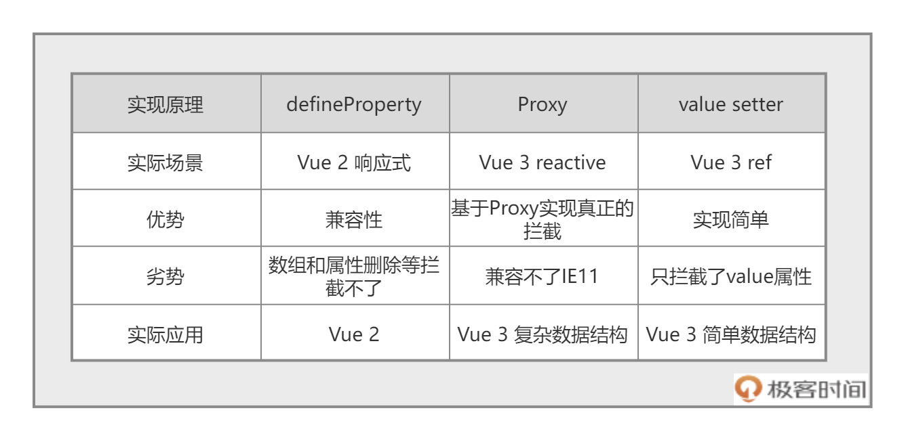

# Vue 笔记

[TOC]

## Vue 响应式原理



### Vue2 defineProperty

```JS
const getDouble = (n) => n*2
const obj = {}
let count = 1
let double = getDouble(count)

Object.defineProperty(obj,'count',{
    get(){
        return count
    },
    set(val){
        count = val
        double = getDouble(val)
    }
})
console.log(double)  // 打印2
obj.count = 2
console.log(double) // 打印4  有种自动变化的感觉
```

```JS
delete obj.count
console.log(double) // doube还是4
```

### Vue3 Proxy

> 通过 `new Proxy `代理了 `obj` 这个对象，然后通过 `get`、`set` 和 `deleteProperty` 函数代理了对象的读取、修改和删除操作，从而实现了响应式的功能。

```JS
const getDouble = (n) => n*2
const obj = {}
let count = 1
let double = getDouble(count)
const proxy = new Proxy(obj,{
    get : function (target,prop) {
        return target[prop]
    },
    set : function (target,prop,value) {
        target[prop] = value;
        if(prop==='count'){
            double = getDouble(value)
        }
    },
    deleteProperty(target,prop){
        delete target[prop]
        if(prop==='count'){
            double = NaN
        }
    }
})
console.log(obj.count,double) // undefined 2
proxy.count = 2
console.log(obj.count,double) // 2 4
delete proxy.count
console.log(obj.count,double) // undefined NaN
```

### Vue3 getter&setter

```JS
const getDouble = n => n * 2
let _value = 1,
double = getDouble(_value)

let count = {
  get value() {
    return _value
  },
  set value(val) {
    _value = val
    double = getDouble(_value)

  }
}
console.log(count.value,double)  // 1 2
count.value = 2
console.log(count.value,double)  // 2 4
```
