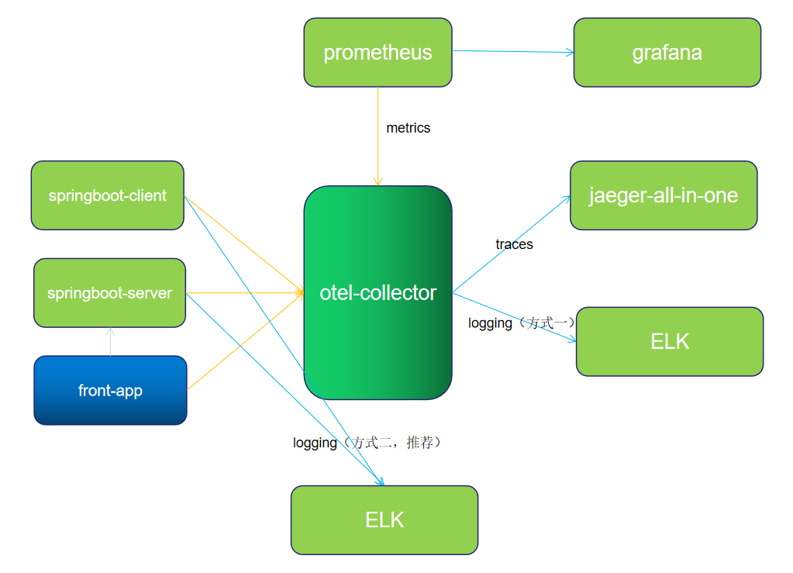

# 可观测性

[toc]

## 基本概念

### 云/云计算（Cloud）

- 云是指通过互联网提供的计算资源和服务，包括存储、计算、网络等基础设施，以及平台和软件等服务。用户可以通过云服务商提供的云平台，在任何时间、任何地点，通过互联网访问这些资源，而不需要关心底层硬件的管理和维护。

### 公有云（Public Cloud）

- 公有云是由第三方云服务提供商（如亚马逊 AWS、微软 Azure、谷歌云）拥有、管理和运营的云计算服务。资源（如计算能力、存储等）是由多个租户共享的，通常可以通过互联网公开访问。

### 私有云（Private Cloud）

- 私有云是专为单个企业或组织使用的云计算环境。私有云的资源可以由企业自有或者由第三方服务商托管。不同于公有云，私有云的服务和基础设施不与其他组织共享。

### 容器、容器编排、微服务

- 容器：将应用和其依赖打包在一个独立的、轻量的环境中，可以在任何地方快速部署和运行。

- 容器编排：通过工具（如 Kubernetes）自动管理多个容器，确保系统的稳定性、扩展性和高可用性。

- 微服务：将大型应用拆解成多个独立的、按功能划分的微服务，每个微服务可以独立开发、部署、扩展和维护。

**举个实际的例子：**
假设你有一个电商平台的系统：

- 用户注册和登录功能属于一个微服务，比如用户服务。
- 订单管理功能属于另一个微服务，比如订单服务。
- 支付功能是另一个微服务，比如支付服务。

这些微服务分别在不同的容器中运行，比如：

- 用户服务运行在容器 A 中。
- 订单服务运行在容器 B 中。
- 支付服务运行在容器 C 中。

随着用户需求的增加，容器编排工具（如 Kubernetes）会根据负载情况，自动创建更多的容器实例来处理请求：

- 当订单服务需要更多计算资源时，Kubernetes 会自动增加订单服务的容器实例。
- 如果支付服务的请求量减少，Kubernetes 会减少支付服务的容器实例。

通过容器化和容器编排，你的电商平台能够在面对不同的负载和需求时，自动调整服务数量，确保系统的高效和稳定。

### 云原生

**云原生**（Cloud Native）是一种开发和部署应用的方式，强调利用云计算的优势来构建、运行和扩展应用程序。它通过一系列设计原则和技术架构，使得应用能够在云环境中更好地工作，具有高扩展性、高可用性、可移植性和自愈能力。

#### 云原生的核心概念

1. **容器化（Containerization）**：

   - 云原生应用通常会被容器化，以确保它们可以在不同的环境中一致地运行。容器打包了应用及其所有依赖，确保从开发到生产环境的迁移更为简便。
   - 容器技术（如 **Docker**）是云原生的基石，能够在虚拟化环境中提供轻量级的运行时环境。

2. **微服务架构（Microservices Architecture）**：

   - 云原生应用通常采用微服务架构，将一个大应用拆分成多个独立的小服务，每个服务通常完成一个单一功能。微服务可以独立开发、测试、部署和扩展。
   - 每个微服务通常运行在独立的容器中，便于分布式管理和灵活扩展。

3. **动态编排（Dynamic Orchestration）**：

   - 由于云原生应用是分布式和容器化的，因此需要一种机制来自动化管理这些容器和微服务。编排工具（如 **Kubernetes**）允许自动部署、扩展、负载均衡和管理容器。
   - 编排系统也能自动监控系统状态，确保应用的高可用性和自愈能力。

4. **声明式管理（Declarative Management）**：

   - 云原生应用倾向于采用声明式配置方式，定义“期望状态”（例如容器的数量、配置等），然后由系统自动调整和确保实际状态与期望状态一致。
   - 例如，使用 Kubernetes 配置一个应用，声明希望有 3 个容器实例在运行，Kubernetes 会自动确保应用保持该状态。

5. **持续交付与持续集成（CI/CD）**：
   - 云原生应用常常结合持续集成与持续交付（CI/CD）流程，实现快速的自动化构建、测试和部署。自动化可以减少人工干预和提高发布频率。
   - CI/CD 工具（如 Jenkins, GitLab CI）能够帮助开发团队快速交付新功能和修复。

#### 云原生的技术栈

1. **容器技术**：如 Docker 用于应用的打包和运行。
2. **编排工具**：如 Kubernetes 用于自动化管理容器。
3. **服务网格**：如 Istio、Linkerd 等，用于管理微服务之间的通信，提供负载均衡、服务发现、安全等功能。
4. **存储与数据库**：如使用云存储、NoSQL 数据库（如 MongoDB, Cassandra）等分布式存储系统。
5. **监控与日志**：如 Prometheus、Grafana、ELK Stack（Elasticsearch, Logstash, Kibana）用于监控、日志收集和故障排除。
6. **DevOps 工具链**：如 Terraform、Ansible 等用于基础设施自动化，结合 CI/CD 工具实现应用的自动部署与管理。

#### 云原生的优势

1. **可扩展性**：

   - 由于云原生应用是基于容器和微服务的，可以根据需求动态调整资源，通过自动扩容和缩容来应对流量波动。

2. **高可用性**：

   - 云原生架构通过分布式部署和服务的冗余来保证高可用性，即使某个服务实例出现故障，其他实例仍然可以继续工作，保证系统整体正常运行。

3. **灵活性和敏捷性**：

   - 云原生支持持续集成、持续交付（CI/CD），使得开发团队能够频繁地发布小规模的更新，提高了产品交付速度和灵活性。

4. **可移植性**：

   - 由于云原生应用通常运行在容器中，容器提供了一种平台无关的运行时环境，使得应用能够在不同的云平台或本地环境中无缝迁移。

5. **弹性和自愈**：
   - 容器编排工具（如 Kubernetes）提供自动化的自愈机制，一旦某个容器出现故障，编排系统会自动重新启动容器，确保系统始终保持运行。

#### 云原生与传统应用架构的区别

| 特性       | 云原生                                    | 传统架构                                   |
| ---------- | ----------------------------------------- | ------------------------------------------ |
| 架构模式   | 微服务架构                                | 单体架构                                   |
| 部署方式   | 容器化，使用容器编排工具（如 Kubernetes） | 传统虚拟机或物理机部署                     |
| 可扩展性   | 高度可扩展，自动化扩容和缩容              | 扩容通常需要手动配置或预先规划             |
| 更新频率   | 快速、频繁的迭代和发布                    | 更新较慢，通常需要较长的周期进行版本发布   |
| 高可用性   | 基于容器编排系统保证服务高可用            | 依赖于硬件和虚拟机的高可用性配置           |
| 开发效率   | 支持 CI/CD、自动化部署，快速交付          | 开发、部署周期长，缺乏自动化，手动操作较多 |
| 弹性与容错 | 自动修复和负载均衡，提供自愈能力          | 依赖于手动干预和传统负载均衡机制           |

#### 云原生应用示例

1. **电商平台**：

   - 电商平台通常会使用云原生架构来支持大规模流量，微服务来拆解不同的功能模块（如用户服务、商品服务、订单服务、支付服务等），容器化这些微服务，并使用 Kubernetes 进行编排和自动扩容。
   - 通过持续集成和交付，开发团队能够快速发布新功能或修复问题，提升产品的敏捷性。

2. **视频流媒体平台**：
   - 流媒体平台如 Netflix 或 YouTube 使用云原生架构来支持高并发用户访问，采用微服务架构来处理视频上传、转码、播放、推荐等功能。
   - 利用 Kubernetes 实现自动化的容器管理，自动扩容应对观看人数的峰值，并保持系统高可用。

#### 结论

云原生架构是一种现代化的开发模式，它利用容器、微服务、自动化编排、CI/CD 等技术，使得应用程序能够更好地利用云计算的弹性、可扩展性和高可用性。与传统的单体应用架构相比，云原生架构提供了更高的灵活性、可扩展性和运维效率，是当前许多云平台和企业采用的最佳实践。

### 四种软件架构：单体架构、分布式架构、微服务架构、Serverless 架构

[参考链接](https://blog.csdn.net/weixin_52243202/article/details/137099171)

### Elasticsearch(ES) 与 ELK

- Elasticsearch 是一个开源的分布式 RESTful ==搜索和分析引擎==、可扩展的数据存储和向量==数据库==（存储日志数据，支持复杂的搜索和聚合操作。）
- Elastic Stack（也称为 ELK Stack）是公认的日志监测领域的领导者，拥有业界最广泛、最全面的系列日志数据源，是备受欢迎的开源日志平台。

### DevOps

**DevOps**（开发与运维的结合）是一种文化、方法论和实践，旨在通过自动化、协作和持续集成等手段，提升软件开发（Dev）和 IT 运维（Ops）之间的协同效率。DevOps 推动开发、运维和其他相关团队之间的紧密合作，以便更快地交付更高质量的软件，并快速响应业务需求。

#### DevOps 的核心理念

1. **跨职能团队协作**：
   DevOps 推动开发、测试、运维等职能团队紧密合作，共同承担应用的开发、部署和维护等任务，消除传统开发和运维之间的壁垒，增强沟通和合作。

2. **持续集成与持续交付（CI/CD）**：

   - **持续集成（CI）**：开发人员频繁地将代码集成到共享的版本库中，并通过自动化测试来确保代码质量。持续集成的目标是让代码能够快速、安全地集成到主干中，减少了集成带来的冲突和问题。
   - **持续交付（CD）**：将代码从开发环境自动部署到生产环境，确保软件始终保持在一个可发布的状态，减少人为部署错误并加快发布周期。

3. **自动化**：
   DevOps 强调自动化，不仅限于测试和部署过程，还包括基础设施管理、监控、日志管理等各个环节。自动化帮助团队减少人工错误、提高效率，并让开发与运维工作更加一致。

4. **监控与反馈**：
   DevOps 提倡通过全面的监控和日志收集，了解系统的健康状况、性能和用户体验。这些数据帮助团队及时发现和修复问题，快速响应变化，并确保软件运行的稳定性。

5. **基础设施即代码（IaC）**：
   DevOps 倡导基础设施管理的自动化和代码化。通过将基础设施的配置（如服务器、网络、存储等）描述成代码，团队可以使用版本控制来管理和共享基础设施代码，实现快速、可靠的基础设施变更。

#### DevOps 的实践

1. **自动化部署**：
   自动化软件的构建、测试、部署等过程，确保从开发到生产的各个环节都可以快速而稳定地完成。

2. **微服务架构**：
   微服务是 DevOps 中的常见架构模式，通过将应用拆分为多个小而独立的服务，使得每个服务可以单独部署、更新和扩展，从而提升灵活性和可维护性。

3. **容器化与容器编排**：
   容器化技术（如 Docker）为 DevOps 提供了一致的开发和生产环境，而容器编排工具（如 Kubernetes）帮助管理和自动化大规模容器应用的部署和扩展。

4. **版本控制**：
   使用 Git 等版本控制系统来管理代码，并在代码中使用“分支”和“合并”机制来支持团队协作和快速迭代。

5. **自动化测试**：
   DevOps 强烈推荐在整个开发过程中进行自动化测试，包括单元测试、集成测试、UI 自动化等，确保每次代码提交后的质量。

6. **CI/CD 流水线**：
   利用 CI/CD 工具（如 Jenkins、GitLab CI、CircleCI 等）构建自动化的构建、测试、部署流水线，确保代码可以快速可靠地从开发环境进入生产环境。

#### DevOps 的工具链

为了实现 DevOps 的目标，通常会用到以下几类工具：

- **版本控制工具**：Git、GitHub、GitLab
- **持续集成/持续交付（CI/CD）工具**：Jenkins、GitLab CI、Travis CI、CircleCI
- **容器化和编排工具**：Docker、Kubernetes、OpenShift
- **配置管理工具**：Ansible、Puppet、Chef
- **监控与日志工具**：Prometheus、Grafana、ELK（Elasticsearch, Logstash, Kibana）
- **基础设施即代码（IaC）工具**：Terraform、CloudFormation

#### DevOps 的好处

1. **更快速的交付**：
   通过自动化和持续集成/交付，团队可以加速从开发到生产的周期，更快速地交付软件。

2. **提高软件质量**：
   DevOps 推动自动化测试和监控，使得问题能够更早被发现和解决，从而提高了软件的质量和稳定性。

3. **更高的协作与效率**：
   由于开发和运维团队之间的紧密合作，沟通效率提高，工作流程变得更加高效。

4. **更高的灵活性和响应速度**：
   DevOps 支持快速反馈和快速迭代，使得团队能够更快地响应业务需求和用户反馈。

5. **减少风险**：
   自动化部署和测试确保代码在发布之前就能够发现潜在的问题，降低了生产环境中的风险。

#### 总结

**DevOps**是一个文化、实践和工具链的集合，旨在提高开发和运维团队的协作效率。通过持续集成、自动化部署、基础设施管理和反馈循环等方法，DevOps 帮助企业加快软件交付速度，提高软件质量，并实现业务需求的快速响应。

### Prometheus

Prometheus 是一个开源的系统监控和报警工具，主要用于记录实时的时序数据（time-series data），例如，应用程序、服务、基础设施等的性能指标。它通过拉取数据（pull-based）模型收集监控信息，并支持灵活的查询语言（PromQL）来查询和分析时序数据。

#### Prometheus 的核心特点

1. **时序数据**：Prometheus 主要用于处理时序数据，也就是带有时间戳的数值数据。
2. **拉取数据模型**：Prometheus 按照一定时间间隔主动从目标系统（如应用服务、数据库、服务器等）中获取指标数据。
3. **PromQL 查询语言**：Prometheus 提供了一种灵活且强大的查询语言 PromQL，可以进行各种聚合、计算、过滤等操作。
4. **自动发现**：支持通过标签和服务发现（Service Discovery）自动检测监控目标。
5. **内置报警系统**：Prometheus 提供了报警规则配置，可以在达到特定条件时发送通知。

#### Prometheus 架构

Prometheus 的架构由以下部分组成：

1. **Prometheus Server**：负责拉取、存储、查询和管理时序数据。
2. **Exporters**：应用程序或服务提供的接口，用于暴露监控指标。常见的 exporter 如 `node_exporter` 用于暴露机器的硬件资源指标，`mysql_exporter` 用于暴露 MySQL 数据库的性能指标。
3. **Alertmanager**：Prometheus 的报警管理工具，负责接收来自 Prometheus 的报警信息，并进行路由、抑制、分组等操作。
4. **Grafana**：与 Prometheus 配合使用，用于可视化监控数据，生成实时的仪表板。

#### 如何使用 Prometheus？

1. 安装 Prometheus

2. 配置 Prometheus 的监控目标
   在 Prometheus 配置文件 prometheus.yml 中，定义监控的目标（targets）。可以使用静态配置或服务发现来动态获取监控目标。

   示例：静态配置: 在这个配置中，Prometheus 会定期从 localhost:9100 获取指标数据（假设 node_exporter 正在该端口运行）。

   ```yaml
   scrape_configs:
     - job_name: "node"
       static_configs:
         - targets: ["localhost:9100"]
   ```

3. 使用 Exporters 暴露指标
   Prometheus 本身并不直接提供监控数据，而是通过 "Exporters" 从目标系统中收集数据。你可以安装不同的 exporters 来获取应用程序或基础设施的指标。

   例如，安装并运行 node_exporter（用于收集系统级指标）;node_exporter 会在 localhost:9100 暴露服务器的硬件资源、内存、磁盘、CPU 等相关指标。

4. 查询监控数据
   Prometheus 提供了一个强大的查询语言 PromQL。你可以在 Prometheus 的 Web UI 中输入查询命令来获取监控数据。
   例如，查询 CPU 使用率：这个查询会返回过去 5 分钟的 CPU 空闲时间的比率。

   ```PromQL
   rate(node_cpu_seconds_total{mode="idle"}[5m])
   ```

5. 配置报警规则
   Prometheus 允许配置报警规则，当某个指标超过预设的阈值时触发报警。报警规则可以配置在`prometheus.yml` 文件中以及`alerts.yml`

6. 使用 Grafana 进行数据可视化
   Prometheus 只负责数据收集和存储，而 Grafana 用于数据的可视化。你可以通过以下方式将 Prometheus 数据源添加到 Grafana：

#### 总结

Prometheus 是一个强大的时序数据监控工具，适用于监控大规模分布式系统和应用。它通过定期拉取目标系统的指标数据，并提供灵活的查询和报警机制，帮助开发者及时发现和解决系统性能问题。通过与 Grafana 配合使用，Prometheus 还能实现实时的监控数据可视化。

### Opentelemetry

[OTEL 是 OpenTelemetry 的简称， 是 CNCF 的一个可观测性项目，旨在提供可观测性领域的标准化方案，解决观测数据的数据模型、采集、处理、导出等的标准化问题，提供与三方 vendor 无关的服务。
OpenTelemetry 是一组标准和工具的集合，旨在管理观测类数据，如 Traces、Metrics、Logs 等 (未来可能有新的观测类数据类型出现)。目前已经是业内的标准](https://docs.guance.com/best-practices/cloud-native/opentelemetry-elk/#elk)


架构说明

1、应用 server 和 client 将 metric 、trace 数据通过 otlp-exporter push 到 otel-collector

2、front-app 为前端链路，将链路信息 push 到 otel-collector，并访问应用服务 API

3、otel-collector 对数据进行收集、转换后，将数据 push 到 Jaeger、Zipkin

4、同时 Prometheus 从 otel-collector pull 数据。

日志两种推送方式：

方式一：通过 OTLP 上报日志

应用 server 和 client 将 log 通过 otlp-exporter push 到 otel-collector，再通过 otel-collector exporter 到 Elasticsearch。由于 OpenTelemetry log 方面还不稳定，所以推荐 log 单独处理，不走 otel-collector，在测试过程中也发下了 同时配置 log 和 metric 存在冲突问题，主要表现在 otel-collector 上，等待官方修复吧。

方式二：通过 Logback-logstash 上报日志

应用 server 和 client 将 log 通过 Logback-logstash 推送到 logstash。

otel-collector 配置了四个 exporter.

```java
prometheus:
endpoint: "0.0.0.0:8889"
const_labels:
label1: value1
zipkin:
endpoint: "http://otel_collector_zipkin:9411/api/v2/spans"
format: proto
jaeger:
endpoint: otel_collector_jaeger:14250
tls:
insecure: true
elasticsearch:
endpoints: "http://192.168.0.17:9200"
```

注意，所有的应用都部署在同一个机器上，机器 ip 为 192.168.0.17。如果应用和一些中间件单独分开部署，则注意修改对应的 IP。如果是云服务器，则注意开放相关端口，以免访问失败。
