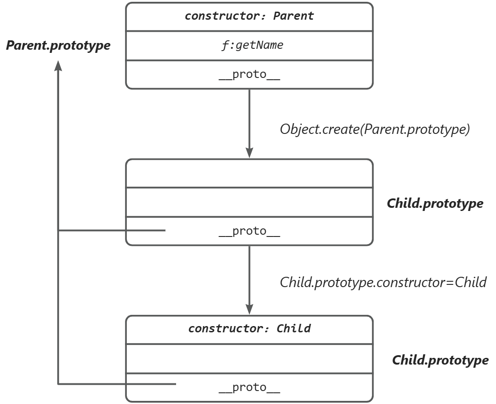

# 手写 js

## 手写 bind

```js
Function.prototype.myBind = function (obj, ...args) {
  let fn = this;
  let res = function (...others) {
    if (this === window) {
      return fn.call(obj, ...args, ...others);
    } else {
      return fn.call(this, ...args, ...others); // 使用new,则this指向new出来的新对象，创建的新对象的构造函数为fn,但是对象的__proto__为res.prototype
    }
  };
  (() => {
    function fnproto() {}
    fnproto.prototype = fn.prototype;
    res.prototype = new fnproto();
  })();
  return res;
};
```

## 手写 JSONP

```js
const jsonp = (url) => {
  let script = document.createElement("script");
  let scriptcallback = document.createElement("script");
  scriptcallback.innerText = `function fn(data){console.log(data);}`;
  script.src = url;
  document.head.appendChild(scriptcallback);
  document.head.appendChild(script);
  let p = new Promise((resolve, reject) => {
    script.onload = resolve;
    script.onerror = reject;
  });
  p.then(() => {
    document.head.removeChild(script);
    document.head.removeChild(scriptcallback);
  });
};
```

## 数组展平

```js
Array.prototype.my_flat = function (depth) {
  let result = [];
  if (depth < 0) return [this];
  for (let a of this) {
    if (a instanceof Array) {
      result = result.concat(a.my_flat(depth - 1));
    }
    if (a === undefined) {
      continue;
    } else result.push(a);
  }
  return result;
};
```

## 原生 AJAX 封装 Promise

```js
async function promiseAjax(url) {
  let promise = new Promise((resolve) => {
    let xhr = new XMLHttpRequest();
    xhr.open("GET", url, false);
    try {
      xhr.onreadystatechange = () => {
        if (xhr.status === 200 && xhr.readyState === 4) {
          resolve(xhr.responseText);
        }
      };
      xhr.send();
    } catch (e) {
      console.log(e);
    }
  });
  let result = await promise;
  return result;
}
```

## 数组去重

```js
const unique = (array) => {
  let hash = {};
  for (let a of array) {
    if (hash[a] === undefined) {
      hash[a] = 1;
    } else continue;
  }
  return Object.keys(hash);
};
```

## Promise.all

```js
function promiseAll(promiseList) {
  return new Promise((resolve, reject) => {
    if (promiseList[Symbol.iterator] === undefined) {
      throw new TypeError(`argument must be a iterable object`);
    }
    //以下只对数组这个情况讨论
    let resolvedCounter = 0;
    // 处理空数组
    if (promiseList.length === 0) {
      resolve([]);
      return;
    }
    const result = [];
    for (let i = 0; i < promiseList.length; i++) {
      //Promise.resolve包装非 Promise 值以兼容混合输入
      Promise.resolve(promiseList[i]).then(
        (value) => {
          resolvedCounter++;
          result[i] = value;
          // 正确判断完成条件
          if (resolvedCounter === promiseList.length) {
            resolve(result);
          }
        },
        (reason) => reject(reason)
      );
    }
  });
}
```

## isArray

```js
Array.isArray = function (obj) {
  return Object.prototype.toString.call(obj) === "[object Array]";
};
```

## Call

```js
Function.prototype.my_call = function (context) {
  context = context || Window; // 空对象
  let [, ...args] = arguments;
  context.fn = this; // 创建属性
  res = context.fn(...args); // 获取结果
  delete context.fn; // 删除属性
  return res;
};
```

## 深克隆

```js
// WeakMap 的 灵活运用
function deepClone(obj: any, cache = new WeakMap()) {
  if (obj === null || typeof obj !== "object") {
    return obj;
  }
  //WeakMap 缓存已拷贝对象，避免对象存在循环引用导致堆栈溢出
  if (cache.has(obj)) {
    return cache.get(obj);
  }
  const clone = Array.isArray(obj) ? [] : {};
  cache.set(obj, clone);
  Object.keys(obj).forEach((key) => {
    clone[k] = deepClone(obj[k], cache);
  });
  return clone;
}
```

## 函数柯里化

```js
function sum(a) {
  return function (b) {
    return function (c) {
      return a * b * c;
    };
  };
}
```

## 手写 apply

```js
Function.prototype.my_apply = function (context) {
  context = context || Window;
  let [, args] = arguments;
  context.fn = this;
  let result = context.fn(args);
  delete context["fn"]; // 点取值与[]取值，见JS高级程序设计
  return result;
};
```

## 寄生式组合继承(手写 extends)



```js
function Child() {
  Parent.call(this);
}
Child.prototype = Object.create(Parent.prototype);
Child.prototype.constructor = Child;
```

## 组合继承

```js
function inherit2() {
  subType.prototype = new superType();
  subType.prototype.constructor = subType;
  function subType() {
    superType.call(this);
  }
}
```

## 寄生式继承

```js
function inherit3() {
  function creatAnother(original) {
    let clone = Object.create(original);
    clone.getFriends = function () {
      return this.friends;
    };
    return clone;
  }
  let subType = clone(subType);
}
```

## 原型式继承

```js
function inherit4() {
  let superType = {
    name: "parent4",
    friends: ["p1", "p2", "p3"],
    getName: function () {
      return this.name;
    },
  };
  let subType = Object.create(superType);
}
```

## 原型链继承

```js
function inherit5() {
  function superType() {
    this.name = "parent1";
    this.play = [1, 2, 3];
  }
  function subType() {}
  subType.prototype = new superType();
}
```

## 盗用函数继承

```js
function inherit6() {
  function superType() {
    this.name = "parent1";
  }
  superType.prototype.getName = function () {
    return this.name;
  };
  function subType() {
    superType.call(this);
  }
}
```

## 封装 Axios

```js
const api = (method, url, params) => {
  return new Promise((resolve) => {
    let promise;
    if (method === "GET") promise = axios.get(url, { params });
    else if (method === "POST") promise = axios.post(url, params);
    else resolve("没有创建此方法");
    promise.then((data) => resolve(data)).catch((e) => console.log(e));
  });
};
```

## 防抖函数

> 1. 高频
> 2. 耗时
> 3. 以最后一次调用为准

- 类比电梯关门时有人进来，每次有人进来我要再按下关门键

```js
function debounce(func, delay) {
  let timer;
  return function (...args) {
    clearTimeout(timer);
    timer = setTimeout(() => func.apply(this, args), delay);
  };
}
```

## 节流函数

- 类比技能 CD，在狂点技能时，在技能 CD 期间无法再次使用技能，
- 当前时间 - 上次技能触发时间 >= 技能 CD 时间 ：方可再次使用技能
- 使用技能后，刷新上次技能触发时间

```js
function throttle(fn, delay) {
  let lastTime = null;
  return function (...args) {
    const now = Date.now();
    if (lastTime === null || now - lastTime >= delay) {
      lastTime = now;
      fn.apply(this, args);
    }
  };
}
```

## 模拟 new

```js
function mockNew() {
  const constructor = [].shift.call(arguments);
  // 判断第一个参数是否为构造函数
  if (typeof constructor !== "function") {
    throw new TypeError("第一个参数不是构造函数");
  }
  // 新建一个空对象，对象的原型为构造函数的 prototype 对象
  const newObject = Object.create(constructor.prototype); // __proto__已被抛弃
  // 将 this 指向新建对象，并执行函数
  const result = constructor.call(newObject, arguments);
  // 判断返回结果
  return result && ["object", "function"].includes(typeof result)
    ? result
    : newObject;
  // => return result instanceof Object?result:newObject  等价于
}
```

## 找到最多的 tagName

```js
function findMostTagname() {
  let hash = new Map(),
    max = -Infinity;
  function dfs(node) {
    for (let i = 0; i < node.childNodes.length; i++) {
      if (node.childNodes[i].tagName) {
        if (hash.has(node.childNodes[i].tagName)) {
          let count = hash.get(node.childNodes[i].tagName);
          hash.set(node.childNodes[i].tagName, count + 1);
          max = Math.max(max, count + 1);
        } else {
          hash.set(node.childNodes[i].tagName, 1);
        }
        if (node.childNodes[i].length !== 0) {
          dfs(node.childNodes[i]);
        }
      }
    }
  }
  let html = document.querySelector("html");
  dfs(html);
  for (let a of hash.keys()) {
    if (hash.get(a) === max) {
      return a;
    }
  }
}
```

## 手写 Promise

```js
class MyPromise {
  constructor(executor) {
    this.state = "pending"; // 初始状态：pending
    this.value = undefined; // 成功的结果值
    this.reason = undefined; // 失败的原因
    this.onFulfilledCallbacks = []; // 成功回调队列
    this.onRejectedCallbacks = []; // 失败回调队列

    const resolve = (value) => {
      if (this.state === "pending") {
        this.state = "fulfilled";
        this.value = value;
        // 异步执行所有成功回调
        this.onFulfilledCallbacks.forEach((fn) => fn());
      }
    };

    const reject = (reason) => {
      if (this.state === "pending") {
        this.state = "rejected";
        this.reason = reason;
        // 异步执行所有失败回调
        this.onRejectedCallbacks.forEach((fn) => fn());
      }
    };

    try {
      // 立即执行执行器函数
      executor(resolve, reject);
    } catch (err) {
      reject(err); // 捕获执行器中的同步错误
    }
  }

  then(onFulfilled, onRejected) {
    // 处理 then 的参数为可选的情况
    onFulfilled =
      typeof onFulfilled === "function" ? onFulfilled : (value) => value;
    onRejected =
      typeof onRejected === "function"
        ? onRejected
        : (reason) => {
            throw reason;
          };

    const promise2 = new MyPromise((resolve, reject) => {
      const handleFulfilled = () => {
        // 使用微任务模拟异步执行
        queueMicrotask(() => {
          try {
            const x = onFulfilled(this.value);
            resolvePromise(promise2, x, resolve, reject);
          } catch (err) {
            reject(err);
          }
        });
      };

      const handleRejected = () => {
        queueMicrotask(() => {
          try {
            const x = onRejected(this.reason);
            resolvePromise(promise2, x, resolve, reject);
          } catch (err) {
            reject(err);
          }
        });
      };

      if (this.state === "fulfilled") {
        handleFulfilled();
      } else if (this.state === "rejected") {
        handleRejected();
      } else {
        // pending
        this.onFulfilledCallbacks.push(handleFulfilled);
        this.onRejectedCallbacks.push(handleRejected);
      }
    });

    return promise2;
  }

  catch(onRejected) {
    return this.then(null, onRejected);
  }
}

// 处理 then 返回值的通用函数
function resolvePromise(promise2, x, resolve, reject) {
  // 避免循环引用
  if (promise2 === x) {
    return reject(new TypeError("Chaining cycle detected for promise"));
  }

  // 如果 x 是 Promise 实例，则等待其状态变化
  if (x instanceof MyPromise) {
    x.then(resolve, reject);
  } else {
    resolve(x); // 直接返回值
  }
}
```

## 控制最大并发数

```js
class ConcurrencyQueue {
  constructor(max) {
    this.max = max;
    this.queue = [];
    this.running = 0;
  }
  enqueue(fn) {
    return new Promise((resolve, reject) => {
      this.queue.push({ fn, resolve, reject });
      this.excute();
    });
  }
  excute() {
    while (this.queue.length && this.running < this.max) {
      const { fn, resolve, reject } = this.queue.shift();
      this.running++;
      fn()
        .then(
          (val) => resolve(val),
          (err) => reject(err)
        )
        .finally(() => {
          this.running--;
          this.excute();
        });
    }
  }
}
```

## 请求去抖

```js
let controller: AbortController | null = null;
function debounceRequest(url: string, callBack: Function): void {
  if (controller) {
    controller.abort();
  }
  controller = new AbortController();
  fetch(url, { signal: controller.signal })
    .then(callBack)
    .finally(() => {
      controller = null;
    });
}
```
